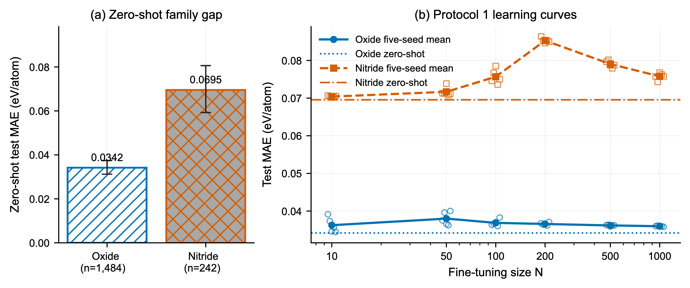

# Is Fine-Tuning Worth It? Reusing a Pretrained AI Model to Predict the Stability of New Materials

[](#planned-license-and-data-terms)
[](#artifact-record)
[](environment/requirements-frozen.txt)

This repository evaluates whether a JARVIS-DFT-pretrained ALIGNN formation-energy model transfers uniformly to oxygen- and nitrogen-containing materials. Zero-shot mean absolute error was **0.0342 eV/atom for oxides** and **0.0695 eV/atom for nitrides**, a nitride-to-oxide ratio of **2.03** (95% structure-bootstrap CI: 1.70–2.42). Across all **36 family-by-training-size comparisons** spanning three optimization protocols, mean last-block-plus-head fine-tuning never outperformed the corresponding family-specific zero-shot baseline.



*Figure 2. (a) Zero-shot MAE by family with 95% percentile intervals from 50,000 within-family structure-bootstrap resamples. (b) Protocol 1 fine-tuning learning curves: open markers show individual seeds, lines show five-seed means, and horizontal reference lines show the family-specific zero-shot baselines.*

## What the evidence says

- The fixed tests contain 1,484 oxides and 242 nitrides, with zero exact identifier overlap against the published checkpoint-training identifiers.
- Partial fine-tuning exposes the final graph-convolution block and output head: 330,241 of 4,026,753 parameters.
- Pretrained initialization still has substantial value relative to matched random initialization; failure to improve the zero-shot estimate is not failure of pretraining.
- Every reported number is traceable through [`paper/evidence_manifest.csv`](paper/evidence_manifest.csv), with full tables in [`results/summaries/`](results/summaries/) and [`paper/supplementary/`](paper/supplementary/).

The conclusions are bounded to this checkpoint, target property, family definition, and protocol range. Family labels do not by themselves establish a formal in- or out-of-distribution classification.

## Five-command quickstart

The following builds a Python environment, fetches the checksum-verified public checkpoint, and reconstructs the family datasets with the committed official split manifest. The first dataset download is network-dependent; the cached local rebuild took about 22 seconds.

```bash
git clone https://github.com/TheArchitect999/ALIGNN-domain-shift.git && cd ALIGNN-domain-shift
python3 -m venv .venv && source .venv/bin/activate
python -m pip install alignn==2025.4.1 jarvis-tools==2026.3.10 numpy==1.26.4 pandas==2.3.3 scikit-learn==1.7.2
python scripts/setup/fetch_pretrained.py
python scripts/setup/rebuild_family_datasets.py
```

For the staged workflow, released evidence authorities, and prerequisites for expensive replay—including training, aggregation, uncertainty analysis, embeddings, figures, and numerical verification—see [`docs/REPRODUCING.md`](docs/REPRODUCING.md). To interpret run directories and tables, see [`docs/RESULTS_GUIDE.md`](docs/RESULTS_GUIDE.md).

## Protocols

All protocols use the same two chemical families, labelled budgets N = 10, 50, 100, 200, 500, and 1,000, five deterministic seeds, AdamW, L1 loss, a one-cycle learning-rate schedule, and validation-selected checkpoints.

The custom trainers instantiate `torch.nn.L1Loss` directly. The inherited `criterion` field retained in upstream-style JSON configs is not consulted by these entry points.

| Protocol | Role | Epochs | Batch size | Peak learning rate | Fine-tuning runs | Main-scope scratch runs |
|---|---|---:|---:|---:|---:|---:|
| 1 | Canonical | 50 | 16 | 1 × 10⁻⁴ | 60 | 20 at N = 50 and 500 |
| 2 | Robustness | 300 | 64 | 1 × 10⁻³ | 60 | — |
| 3 | Robustness | 100 | 32 | 5 × 10⁻⁵ | 60 | — |

## Repository map

| Path | Purpose |
|---|---|
| [`configs/`](configs/) | Pretrained-model and protocol-specific run configurations |
| [`data/`](data/) | Family definitions, official split manifests, counts, and integrity diagnostics |
| [`scripts/`](scripts/) | Dataset, training, aggregation, uncertainty, embedding, and figure code |
| [`results/protocol_1/`](results/protocol_1/) | Canonical per-run configs, histories, summaries, and predictions |
| [`results/protocol_2/`](results/protocol_2/) and [`protocol_3/`](results/protocol_3/) | Robustness-protocol outputs |
| [`results/zero_shot/`](results/zero_shot/) | Canonical per-structure zero-shot predictions |
| [`results/summaries/`](results/summaries/) | Seed aggregates and supporting effect-size analyses |
| [`results/derived_evidence/`](results/derived_evidence/) | Compact validated inputs for deterministic figure regeneration |
| [`results/embeddings/`](results/embeddings/) | Frozen representations and geometry/distance results |
| [`paper/figures/`](paper/figures/) | Final PNG/SVG figures, plot data, captions, and checksums |
| [`paper/supplementary/`](paper/supplementary/) | Supplementary document, tables, and figures |
| [`PROVENANCE.md`](PROVENANCE.md) | Archive pin, checkpoint provenance, and public path remapping |

## Artifact record

The artifact record has the reserved DOI **10.5281/zenodo.21398774**. It remains unpublished while the research artifact is under review; the badge and citation will be updated when the record is released. The checkpoint fetcher therefore uses the official Figshare archive first and the Zenodo copy only as a mirror.

## Citation

The manuscript is under review; citation details will be updated upon publication.

```text
Faizan Ahmed, Muhammad Ali Bin Sarwar, and Burhan Saifaddin. 2026.
Is Fine-Tuning Worth It? Reusing a Pretrained AI Model to Predict the Stability
of New Materials. Manuscript under review.
```

## Acknowledgments

This study uses [JARVIS-DFT](https://doi.org/10.1038/s41524-020-00440-1), the [ALIGNN architecture](https://doi.org/10.1038/s41524-021-00650-1), and the [official pretrained checkpoint](https://doi.org/10.6084/m9.figshare.17005681.v1) released by the JARVIS/NIST team. The authors acknowledge King Fahd University of Petroleum and Minerals for its institutional and computational environment. No external funding supported this work.

## Planned license and data terms

The intended public-release terms are MIT for code and CC BY 4.0 for documentation and original figures; the repository license metadata will be added before publication. JARVIS/NIST data and the upstream checkpoint remain governed by their original terms; see [`PROVENANCE.md`](PROVENANCE.md).
