# Supplementary Materials for “Is Fine-Tuning Worth It? Reusing a Pretrained AI Model to Predict the Stability of New Materials”

Faizan Ahmed; Muhammad Ali Bin Sarwar; Dr. Burhan Saifaddin (corresponding author)

This supplement follows the manuscript from data and checkpoint provenance through adaptation effects, run-level results, cross-protocol robustness, and frozen-representation geometry. Every reported value traces to the machine-readable tables under `data/` or to `../evidence_manifest.csv`. Protocol 1 is canonical; Protocols 2 and 3 are robustness evidence and are not pooled with it. Historical paths embedded in archived run summaries are not treated as evidence.

### Map from the manuscript to this supplement

| manuscript element | Supplement section(s) |
| --- | --- |
| Methods — data, families, provenance (Section 3.1, Table 1) | S1, S2 |
| Methods — adaptation effect-size definitions (Section 3.2) | S3 |
| Results — zero-shot gap and residual structure (Section 4.1) | S4 |
| Results — Protocol 1 adaptation surface, effect sizes, Table 3 (Section 4.2) | S3, S5, S6 |
| Results — structure-level heterogeneity (Section 4.2) | S7 |
| Results — learning dynamics (Section 4.2) | S8 |
| Results — value of pretrained initialization, Table 4 (Section 4.3) | S5 |
| Results — cross-protocol robustness and effect ranges (Section 4.4) | S9, S10 |
| Results — representation geometry and distance–error (Section 4.5) | S11, S12, S13 |

## Traceability convention

Each numerical row carries a stable trace identifier. A run-level identifier resolves to separate `-MAE` and `-EPOCH` records in the manifest. Figure captions carry figure trace identifiers whose source lists and hashes are frozen in `data/figure_manifest.csv`. Values are printed to six decimals for audit tables; the manifest retains raw precision.

## S1. Dataset composition, duplicate resolution, and split audit

This section documents the dataset construction that underlies the manuscript's Methods (Section 3.1) and Table 1: how the source catalog was deduplicated and how the global train/validation/test split was formed, together with the family definitions and the canonical-run integrity checks. It backs the membership and integrity claims on which every downstream result depends.

The original source contained 55,723 records. Removing 11 excess rows across five duplicated JIDs yielded 55,712 deduplicated catalog JIDs [P5-G-SOURCE-55723; P5-G-EXCESS-11; P5-G-DUPJID-5; P5-G-CATALOG-55712]. The final assigned global split contains 44,567 train, 5,572 validation, and 5,570 test JIDs, with zero pairwise overlap; three JIDs remain unassigned because of two train/test conflicts and one catalog-only identifier [P5-G-TRAIN-44567; P5-G-VAL-5572; P5-G-TEST-5570; P5-G-UNASSIGNED-3].

### S1.1 Duplicate resolution

| JID | Occurrences | Excess rows | Kept index | Resolution | Trace |
| --- | --- | --- | --- | --- | --- |
| JVASP-100669 | 2 | 1 | 16288 | deterministic_first_seen_among_equal_quality_scores | P5-DD-001 |
| JVASP-113961 | 2 | 1 | 51690 | deterministic_first_seen_among_equal_quality_scores | P5-DD-002 |
| JVASP-116461 | 3 | 2 | 52707 | deterministic_first_seen_among_equal_quality_scores | P5-DD-003 |
| JVASP-96735 | 6 | 5 | 13734 | deterministic_first_seen_among_equal_quality_scores | P5-DD-004 |
| JVASP-97311 | 3 | 2 | 1585 | deterministic_first_seen_among_equal_quality_scores | P5-DD-005 |

### S1.2 Family and canonical-run audit summary

| Item | Result | Trace |
| --- | --- | --- |
| Oxide definition and count | O-bearing including O+N; 14,991 total, 1,484 test | P5-G-OXIDE-COUNTS |
| Nitride definition and count | N-bearing without O; 2,288 total, 242 test | P5-G-NITRIDE-COUNTS |
| Oxynitrides | 499, all retained in oxide | P5-G-OXYN-499 |
| Canonical dataset roots | 120/120 passed | P5-G-ROOTS-120 |
| Canonical run split files | 240/240 passed; zero fixed-test drift or leakage | P5-G-SPLITS-240 |
| Structure-directory coverage | oxide 14,991/14,991; nitride 2,288/2,288 | P5-G-STRUCTURES |

The original 55,723-record structural payload is not tracked locally, so raw duplicate structure bodies and kept indices cannot be replayed. Frozen multiplicities, metadata, arithmetic, the deduplicated catalog, all 120 dataset roots, and all 240 canonical run splits agree.

## S2. Checkpoint provenance and exact-overlap methodology

This section gives the provenance of the evaluated checkpoint (file hashes and the official-archive match) and the exact identifier-overlap methodology behind the membership-verification statements in the manuscript's Methods (Section 3.1). Zero exact overlap prevents direct training-item leakage but is not interpreted as a statistical distribution label.

The local checkpoint is `checkpoint_300.pt` (SHA-256 `bce5cdafa06dc26ad8ddb3ceeb2bef7593c218dd66825e7cb5381c156317458f`, 48,614,953 bytes; CRC32 `a7b440ce`), matching the member in official Figshare file 31458679 [P5-G-CHECKPOINT]. The local configuration is byte-identical to the archive configuration (SHA-256 `abfb9b6922e90157210e7583ccdd41eea9204df08794489654ea1f4f67bd2589`) [P5-G-CONFIG]. The same archive contains `ids_train_val_test.json`, which supplies 44,578 training entries and 44,569 unique training JIDs [P5-G-TRAINIDS].

| Fixed test family | Test JIDs | Unique checkpoint-training JIDs | Exact overlap | Method | Trace |
| --- | --- | --- | --- | --- | --- |
| oxide | 1484 | 44569 | 0 | Exact JID intersection with unique official id_train entries | P5-G-OVERLAP-OXIDE |
| nitride | 242 | 44569 | 0 | Exact JID intersection with unique official id_train entries | P5-G-OVERLAP-NITRIDE |

The overlap is an exact JID-set intersection after deduplicating training identifiers. Zero exact overlap does not establish statistical in-distribution or out-of-distribution status, and no ID/OOD conclusion is drawn. The official identifier metadata itself contains two train/test conflicts; the audit reports rather than silently repairs them. The archive MD5 is Figshare-reported and was not independently recomputed locally, and no finer dataset snapshot label is available beyond JARVIS-DFT / `dft_3d`.

## S3. Adaptation effect sizes and seed consistency

This section provides the full effect-size backing for the manuscript's Section 3.2 definitions and the restructured Table 3 in Section 4.2. For each Protocol 1 condition we report the absolute adaptation change Δadapt = MAE_FT − MAE_ZS, where a positive value means the tested fine-tuning increased the fixed-test MAE (was worse), and its relative form Radapt = 100 · Δadapt / MAE_ZS. MAE_FT is the five-seed mean fine-tuned MAE (reducible from S5); MAE_ZS is the family zero-shot fixed-test MAE. The final column counts, of the five seeds, how many finished above the family zero-shot baseline. Across the 12 Protocol 1 conditions every seed in every condition finished worse than its family zero-shot baseline — 60 seed-level runs in total — so the non-improving adaptation surface holds at the seed level and not only in the condition means.

| Family | N | Fine-tuned MAE (mean) | Zero-shot MAE | Δadapt (eV/atom) | Radapt (%) | Seeds worse than ZS | Trace |
| --- | --- | --- | --- | --- | --- | --- | --- |
| Oxide | 10 | 0.03624 | 0.03418 | +0.00206 | 6.0 | 5/5 | A1-OX-10 |
| Oxide | 50 | 0.03800 | 0.03418 | +0.00381 | 11.2 | 5/5 | A1-OX-50 |
| Oxide | 100 | 0.03687 | 0.03418 | +0.00269 | 7.9 | 5/5 | A1-OX-100 |
| Oxide | 200 | 0.03658 | 0.03418 | +0.00240 | 7.0 | 5/5 | A1-OX-200 |
| Oxide | 500 | 0.03619 | 0.03418 | +0.00200 | 5.9 | 5/5 | A1-OX-500 |
| Oxide | 1,000 | 0.03597 | 0.03418 | +0.00179 | 5.2 | 5/5 | A1-OX-1000 |
| Nitride | 10 | 0.07040 | 0.06954 | +0.00086 | 1.2 | 5/5 | A1-NI-10 |
| Nitride | 50 | 0.07167 | 0.06954 | +0.00213 | 3.1 | 5/5 | A1-NI-50 |
| Nitride | 100 | 0.07567 | 0.06954 | +0.00613 | 8.8 | 5/5 | A1-NI-100 |
| Nitride | 200 | 0.08528 | 0.06954 | +0.01574 | 22.6 | 5/5 | A1-NI-200 |
| Nitride | 500 | 0.07905 | 0.06954 | +0.00951 | 13.7 | 5/5 | A1-NI-500 |
| Nitride | 1,000 | 0.07577 | 0.06954 | +0.00623 | 9.0 | 5/5 | A1-NI-1000 |

## S4. Zero-shot residual-distribution decomposition

This section decomposes the zero-shot error distribution behind the manuscript's Section 4.1, showing that the chemical-family gap is heavy-tailed rather than a uniform inflation. The first table reports, per family, the signed mean error (bias), the median absolute error, the RMSE, the 90th and 95th absolute-error percentiles, and the number and total-error share carried by the worst decile of structures. The second table reports the mean absolute error within quartiles of the target formation-energy distribution, with the quartile upper bounds; difficulty concentrates in the highest-formation-energy quartile in both families.

| Family | n | Signed mean error | Median AE | RMSE | p90 AE | p95 AE | Worst-decile n | Worst-decile AE share | Trace |
| --- | --- | --- | --- | --- | --- | --- | --- | --- | --- |
| Oxide | 1484 | -0.00833 | 0.01545 | 0.07002 | 0.07865 | 0.14216 | 149 | 0.5079 | A2-OX-DIST |
| Nitride | 242 | -0.01628 | 0.04194 | 0.10956 | 0.18068 | 0.22724 | 25 | 0.3926 | A2-NI-DIST |

Absolute-error concentration by target formation-energy quartile (bounds in eV/atom; MAE in eV/atom):

| Family | Q1 upper bound | Q2 upper bound | Q3 upper bound | MAE Q1 | MAE Q2 | MAE Q3 | MAE Q4 | Trace |
| --- | --- | --- | --- | --- | --- | --- | --- | --- |
| Oxide | -2.5760 | -1.9935 | -1.3633 | 0.02611 | 0.02934 | 0.02950 | 0.05179 | A2-OX-QUART |
| Nitride | -1.1340 | -0.3120 | 0.2623 | 0.04726 | 0.04400 | 0.07574 | 0.11086 | A2-NI-QUART |

## S5. Per-seed results for all 240 repository training runs

This section lists every per-seed run behind the manuscript's Section 4.2 Protocol 1 curves (Table 3) and the Section 4.3 from-scratch comparison (Table 4). All aggregate means and sample standard deviations reported in the manuscript, and the effect sizes in S3, reduce from these rows.

The inventory contains 180 fine-tuning runs and 60 from-scratch runs. The 200-run main scope comprises all 180 fine-tuning runs plus the 20 Protocol 1 scratch runs. The remaining 40 Protocol 2–3 scratch runs are additional repository robustness evidence and are labelled `additional` below [P5-G-RUNS-240; P5-G-MAIN-200; P5-G-EXTRA-40]. MAE is recomputed row-wise from each prediction CSV. Best epoch is the unique validation-loss argmin; this is necessary for all 60 scratch summaries, which omit that field.

### S5.1 Protocol 1 oxide fine-tuning runs

| N | Seed | Train/val | Test MAE (eV/atom) | Best epoch | Scope | Trace |
| --- | --- | --- | --- | --- | --- | --- |
| 10 | 0 | 5/5 | 0.039144 | 1 | main | P5-R001 |
| 10 | 1 | 5/5 | 0.037358 | 1 | main | P5-R002 |
| 10 | 2 | 5/5 | 0.034601 | 1 | main | P5-R003 |
| 10 | 3 | 5/5 | 0.035633 | 1 | main | P5-R004 |
| 10 | 4 | 5/5 | 0.034472 | 1 | main | P5-R005 |
| 50 | 0 | 45/5 | 0.037512 | 33 | main | P5-R006 |
| 50 | 1 | 45/5 | 0.039627 | 19 | main | P5-R007 |
| 50 | 2 | 45/5 | 0.036575 | 32 | main | P5-R008 |
| 50 | 3 | 45/5 | 0.036241 | 27 | main | P5-R009 |
| 50 | 4 | 45/5 | 0.040028 | 10 | main | P5-R010 |
| 100 | 0 | 90/10 | 0.036354 | 23 | main | P5-R011 |
| 100 | 1 | 90/10 | 0.036677 | 33 | main | P5-R012 |
| 100 | 2 | 90/10 | 0.037010 | 49 | main | P5-R013 |
| 100 | 3 | 90/10 | 0.036044 | 26 | main | P5-R014 |
| 100 | 4 | 90/10 | 0.038286 | 14 | main | P5-R015 |
| 200 | 0 | 180/20 | 0.036765 | 28 | main | P5-R016 |
| 200 | 1 | 180/20 | 0.036388 | 23 | main | P5-R017 |
| 200 | 2 | 180/20 | 0.036471 | 15 | main | P5-R018 |
| 200 | 3 | 180/20 | 0.036147 | 40 | main | P5-R019 |
| 200 | 4 | 180/20 | 0.037138 | 38 | main | P5-R020 |
| 500 | 0 | 450/50 | 0.036267 | 31 | main | P5-R021 |
| 500 | 1 | 450/50 | 0.036368 | 7 | main | P5-R022 |
| 500 | 2 | 450/50 | 0.035931 | 18 | main | P5-R023 |
| 500 | 3 | 450/50 | 0.036173 | 28 | main | P5-R024 |
| 500 | 4 | 450/50 | 0.036200 | 50 | main | P5-R025 |
| 1000 | 0 | 900/100 | 0.035984 | 34 | main | P5-R026 |
| 1000 | 1 | 900/100 | 0.036143 | 13 | main | P5-R027 |
| 1000 | 2 | 900/100 | 0.035948 | 23 | main | P5-R028 |
| 1000 | 3 | 900/100 | 0.035967 | 27 | main | P5-R029 |
| 1000 | 4 | 900/100 | 0.035810 | 44 | main | P5-R030 |

### S5.2 Protocol 1 nitride fine-tuning runs

| N | Seed | Train/val | Test MAE (eV/atom) | Best epoch | Scope | Trace |
| --- | --- | --- | --- | --- | --- | --- |
| 10 | 0 | 5/5 | 0.070675 | 1 | main | P5-R031 |
| 10 | 1 | 5/5 | 0.070355 | 1 | main | P5-R032 |
| 10 | 2 | 5/5 | 0.070161 | 1 | main | P5-R033 |
| 10 | 3 | 5/5 | 0.070299 | 1 | main | P5-R034 |
| 10 | 4 | 5/5 | 0.070531 | 1 | main | P5-R035 |
| 50 | 0 | 45/5 | 0.071318 | 1 | main | P5-R036 |
| 50 | 1 | 45/5 | 0.071227 | 1 | main | P5-R037 |
| 50 | 2 | 45/5 | 0.073843 | 1 | main | P5-R038 |
| 50 | 3 | 45/5 | 0.070799 | 1 | main | P5-R039 |
| 50 | 4 | 45/5 | 0.071170 | 1 | main | P5-R040 |
| 100 | 0 | 90/10 | 0.074579 | 1 | main | P5-R041 |
| 100 | 1 | 90/10 | 0.076684 | 1 | main | P5-R042 |
| 100 | 2 | 90/10 | 0.078502 | 1 | main | P5-R043 |
| 100 | 3 | 90/10 | 0.073596 | 1 | main | P5-R044 |
| 100 | 4 | 90/10 | 0.074998 | 1 | main | P5-R045 |
| 200 | 0 | 180/20 | 0.086372 | 49 | main | P5-R046 |
| 200 | 1 | 180/20 | 0.085191 | 1 | main | P5-R047 |
| 200 | 2 | 180/20 | 0.084608 | 1 | main | P5-R048 |
| 200 | 3 | 180/20 | 0.085278 | 1 | main | P5-R049 |
| 200 | 4 | 180/20 | 0.084959 | 1 | main | P5-R050 |
| 500 | 0 | 450/50 | 0.079671 | 40 | main | P5-R051 |
| 500 | 1 | 450/50 | 0.080179 | 31 | main | P5-R052 |
| 500 | 2 | 450/50 | 0.078716 | 50 | main | P5-R053 |
| 500 | 3 | 450/50 | 0.077930 | 46 | main | P5-R054 |
| 500 | 4 | 450/50 | 0.078739 | 35 | main | P5-R055 |
| 1000 | 0 | 900/100 | 0.075758 | 32 | main | P5-R056 |
| 1000 | 1 | 900/100 | 0.074291 | 43 | main | P5-R057 |
| 1000 | 2 | 900/100 | 0.076762 | 38 | main | P5-R058 |
| 1000 | 3 | 900/100 | 0.076280 | 41 | main | P5-R059 |
| 1000 | 4 | 900/100 | 0.075774 | 49 | main | P5-R060 |

### S5.3 Protocol 1 oxide from-scratch runs

| N | Seed | Train/val | Test MAE (eV/atom) | Best epoch | Scope | Trace |
| --- | --- | --- | --- | --- | --- | --- |
| 50 | 0 | 45/5 | 0.603628 | 48 | main | P5-R061 |
| 50 | 1 | 45/5 | 0.573280 | 24 | main | P5-R062 |
| 50 | 2 | 45/5 | 0.491110 | 44 | main | P5-R063 |
| 50 | 3 | 45/5 | 0.510386 | 39 | main | P5-R064 |
| 50 | 4 | 45/5 | 0.601862 | 40 | main | P5-R065 |
| 500 | 0 | 450/50 | 0.251905 | 48 | main | P5-R066 |
| 500 | 1 | 450/50 | 0.300994 | 30 | main | P5-R067 |
| 500 | 2 | 450/50 | 0.269134 | 27 | main | P5-R068 |
| 500 | 3 | 450/50 | 0.258114 | 41 | main | P5-R069 |
| 500 | 4 | 450/50 | 0.241533 | 48 | main | P5-R070 |

### S5.4 Protocol 1 nitride from-scratch runs

| N | Seed | Train/val | Test MAE (eV/atom) | Best epoch | Scope | Trace |
| --- | --- | --- | --- | --- | --- | --- |
| 50 | 0 | 45/5 | 0.684148 | 35 | main | P5-R071 |
| 50 | 1 | 45/5 | 0.680710 | 21 | main | P5-R072 |
| 50 | 2 | 45/5 | 0.680827 | 15 | main | P5-R073 |
| 50 | 3 | 45/5 | 0.719413 | 23 | main | P5-R074 |
| 50 | 4 | 45/5 | 0.692075 | 18 | main | P5-R075 |
| 500 | 0 | 450/50 | 0.358263 | 38 | main | P5-R076 |
| 500 | 1 | 450/50 | 0.385056 | 49 | main | P5-R077 |
| 500 | 2 | 450/50 | 0.394797 | 45 | main | P5-R078 |
| 500 | 3 | 450/50 | 0.335300 | 35 | main | P5-R079 |
| 500 | 4 | 450/50 | 0.367954 | 29 | main | P5-R080 |

### S5.5 Protocol 2 oxide fine-tuning runs

| N | Seed | Train/val | Test MAE (eV/atom) | Best epoch | Scope | Trace |
| --- | --- | --- | --- | --- | --- | --- |
| 10 | 0 | 5/5 | 0.038484 | 1 | main | P5-R081 |
| 10 | 1 | 5/5 | 0.041560 | 22 | main | P5-R082 |
| 10 | 2 | 5/5 | 0.034354 | 1 | main | P5-R083 |
| 10 | 3 | 5/5 | 0.035108 | 1 | main | P5-R084 |
| 10 | 4 | 5/5 | 0.034319 | 1 | main | P5-R085 |
| 50 | 0 | 45/5 | 0.035771 | 1 | main | P5-R086 |
| 50 | 1 | 45/5 | 0.038700 | 19 | main | P5-R087 |
| 50 | 2 | 45/5 | 0.036559 | 17 | main | P5-R088 |
| 50 | 3 | 45/5 | 0.035495 | 1 | main | P5-R089 |
| 50 | 4 | 45/5 | 0.035147 | 1 | main | P5-R090 |
| 100 | 0 | 90/10 | 0.036477 | 31 | main | P5-R091 |
| 100 | 1 | 90/10 | 0.041200 | 76 | main | P5-R092 |
| 100 | 2 | 90/10 | 0.037544 | 48 | main | P5-R093 |
| 100 | 3 | 90/10 | 0.036296 | 30 | main | P5-R094 |
| 100 | 4 | 90/10 | 0.038564 | 1 | main | P5-R095 |
| 200 | 0 | 180/20 | 0.036421 | 41 | main | P5-R096 |
| 200 | 1 | 180/20 | 0.036149 | 29 | main | P5-R097 |
| 200 | 2 | 180/20 | 0.036034 | 40 | main | P5-R098 |
| 200 | 3 | 180/20 | 0.036420 | 49 | main | P5-R099 |
| 200 | 4 | 180/20 | 0.038337 | 92 | main | P5-R100 |
| 500 | 0 | 450/50 | 0.036709 | 26 | main | P5-R101 |
| 500 | 1 | 450/50 | 0.035974 | 16 | main | P5-R102 |
| 500 | 2 | 450/50 | 0.035863 | 23 | main | P5-R103 |
| 500 | 3 | 450/50 | 0.035935 | 28 | main | P5-R104 |
| 500 | 4 | 450/50 | 0.036424 | 38 | main | P5-R105 |
| 1000 | 0 | 900/100 | 0.035245 | 32 | main | P5-R106 |
| 1000 | 1 | 900/100 | 0.035511 | 21 | main | P5-R107 |
| 1000 | 2 | 900/100 | 0.035540 | 36 | main | P5-R108 |
| 1000 | 3 | 900/100 | 0.035539 | 27 | main | P5-R109 |
| 1000 | 4 | 900/100 | 0.035597 | 26 | main | P5-R110 |

### S5.6 Protocol 2 nitride fine-tuning runs

| N | Seed | Train/val | Test MAE (eV/atom) | Best epoch | Scope | Trace |
| --- | --- | --- | --- | --- | --- | --- |
| 10 | 0 | 5/5 | 0.070671 | 1 | main | P5-R111 |
| 10 | 1 | 5/5 | 0.070257 | 1 | main | P5-R112 |
| 10 | 2 | 5/5 | 0.070203 | 1 | main | P5-R113 |
| 10 | 3 | 5/5 | 0.070243 | 1 | main | P5-R114 |
| 10 | 4 | 5/5 | 0.070424 | 1 | main | P5-R115 |
| 50 | 0 | 45/5 | 0.071180 | 3 | main | P5-R116 |
| 50 | 1 | 45/5 | 0.069955 | 1 | main | P5-R117 |
| 50 | 2 | 45/5 | 0.070360 | 1 | main | P5-R118 |
| 50 | 3 | 45/5 | 0.069748 | 1 | main | P5-R119 |
| 50 | 4 | 45/5 | 0.069870 | 1 | main | P5-R120 |
| 100 | 0 | 90/10 | 0.070733 | 1 | main | P5-R121 |
| 100 | 1 | 90/10 | 0.070984 | 1 | main | P5-R122 |
| 100 | 2 | 90/10 | 0.071126 | 1 | main | P5-R123 |
| 100 | 3 | 90/10 | 0.070393 | 1 | main | P5-R124 |
| 100 | 4 | 90/10 | 0.070571 | 1 | main | P5-R125 |
| 200 | 0 | 180/20 | 0.071146 | 1 | main | P5-R126 |
| 200 | 1 | 180/20 | 0.071971 | 1 | main | P5-R127 |
| 200 | 2 | 180/20 | 0.070996 | 1 | main | P5-R128 |
| 200 | 3 | 180/20 | 0.071218 | 1 | main | P5-R129 |
| 200 | 4 | 180/20 | 0.071014 | 1 | main | P5-R130 |
| 500 | 0 | 450/50 | 0.076447 | 1 | main | P5-R131 |
| 500 | 1 | 450/50 | 0.076587 | 1 | main | P5-R132 |
| 500 | 2 | 450/50 | 0.075635 | 1 | main | P5-R133 |
| 500 | 3 | 450/50 | 0.073946 | 232 | main | P5-R134 |
| 500 | 4 | 450/50 | 0.076099 | 1 | main | P5-R135 |
| 1000 | 0 | 900/100 | 0.073526 | 108 | main | P5-R136 |
| 1000 | 1 | 900/100 | 0.074937 | 109 | main | P5-R137 |
| 1000 | 2 | 900/100 | 0.074786 | 41 | main | P5-R138 |
| 1000 | 3 | 900/100 | 0.074071 | 110 | main | P5-R139 |
| 1000 | 4 | 900/100 | 0.075733 | 94 | main | P5-R140 |

### S5.7 Protocol 2 oxide from-scratch runs

| N | Seed | Train/val | Test MAE (eV/atom) | Best epoch | Scope | Trace |
| --- | --- | --- | --- | --- | --- | --- |
| 50 | 0 | 45/5 | 0.522320 | 66 | additional | P5-R141 |
| 50 | 1 | 45/5 | 0.525870 | 62 | additional | P5-R142 |
| 50 | 2 | 45/5 | 0.454747 | 148 | additional | P5-R143 |
| 50 | 3 | 45/5 | 0.446839 | 155 | additional | P5-R144 |
| 50 | 4 | 45/5 | 0.513709 | 135 | additional | P5-R145 |
| 500 | 0 | 450/50 | 0.198931 | 249 | additional | P5-R146 |
| 500 | 1 | 450/50 | 0.197126 | 256 | additional | P5-R147 |
| 500 | 2 | 450/50 | 0.191130 | 299 | additional | P5-R148 |
| 500 | 3 | 450/50 | 0.197462 | 277 | additional | P5-R149 |
| 500 | 4 | 450/50 | 0.187611 | 280 | additional | P5-R150 |

### S5.8 Protocol 2 nitride from-scratch runs

| N | Seed | Train/val | Test MAE (eV/atom) | Best epoch | Scope | Trace |
| --- | --- | --- | --- | --- | --- | --- |
| 50 | 0 | 45/5 | 0.586385 | 55 | additional | P5-R151 |
| 50 | 1 | 45/5 | 0.609385 | 66 | additional | P5-R152 |
| 50 | 2 | 45/5 | 0.765455 | 22 | additional | P5-R153 |
| 50 | 3 | 45/5 | 0.597739 | 88 | additional | P5-R154 |
| 50 | 4 | 45/5 | 0.572224 | 107 | additional | P5-R155 |
| 500 | 0 | 450/50 | 0.267643 | 293 | additional | P5-R156 |
| 500 | 1 | 450/50 | 0.286897 | 233 | additional | P5-R157 |
| 500 | 2 | 450/50 | 0.279344 | 249 | additional | P5-R158 |
| 500 | 3 | 450/50 | 0.259984 | 255 | additional | P5-R159 |
| 500 | 4 | 450/50 | 0.245074 | 246 | additional | P5-R160 |

### S5.9 Protocol 3 oxide fine-tuning runs

| N | Seed | Train/val | Test MAE (eV/atom) | Best epoch | Scope | Trace |
| --- | --- | --- | --- | --- | --- | --- |
| 10 | 0 | 5/5 | 0.039182 | 1 | main | P5-R161 |
| 10 | 1 | 5/5 | 0.037386 | 1 | main | P5-R162 |
| 10 | 2 | 5/5 | 0.034617 | 1 | main | P5-R163 |
| 10 | 3 | 5/5 | 0.035665 | 1 | main | P5-R164 |
| 10 | 4 | 5/5 | 0.034484 | 1 | main | P5-R165 |
| 50 | 0 | 45/5 | 0.039949 | 1 | main | P5-R166 |
| 50 | 1 | 45/5 | 0.039815 | 46 | main | P5-R167 |
| 50 | 2 | 45/5 | 0.036417 | 50 | main | P5-R168 |
| 50 | 3 | 45/5 | 0.036179 | 59 | main | P5-R169 |
| 50 | 4 | 45/5 | 0.039831 | 25 | main | P5-R170 |
| 100 | 0 | 90/10 | 0.036226 | 75 | main | P5-R171 |
| 100 | 1 | 90/10 | 0.036659 | 71 | main | P5-R172 |
| 100 | 2 | 90/10 | 0.036479 | 94 | main | P5-R173 |
| 100 | 3 | 90/10 | 0.035797 | 68 | main | P5-R174 |
| 100 | 4 | 90/10 | 0.039098 | 27 | main | P5-R175 |
| 200 | 0 | 180/20 | 0.036284 | 70 | main | P5-R176 |
| 200 | 1 | 180/20 | 0.036019 | 90 | main | P5-R177 |
| 200 | 2 | 180/20 | 0.036150 | 33 | main | P5-R178 |
| 200 | 3 | 180/20 | 0.035951 | 71 | main | P5-R179 |
| 200 | 4 | 180/20 | 0.036441 | 65 | main | P5-R180 |
| 500 | 0 | 450/50 | 0.036343 | 31 | main | P5-R181 |
| 500 | 1 | 450/50 | 0.035917 | 34 | main | P5-R182 |
| 500 | 2 | 450/50 | 0.035668 | 98 | main | P5-R183 |
| 500 | 3 | 450/50 | 0.035535 | 74 | main | P5-R184 |
| 500 | 4 | 450/50 | 0.035862 | 57 | main | P5-R185 |
| 1000 | 0 | 900/100 | 0.035801 | 31 | main | P5-R186 |
| 1000 | 1 | 900/100 | 0.035710 | 54 | main | P5-R187 |
| 1000 | 2 | 900/100 | 0.035508 | 68 | main | P5-R188 |
| 1000 | 3 | 900/100 | 0.035517 | 88 | main | P5-R189 |
| 1000 | 4 | 900/100 | 0.035319 | 44 | main | P5-R190 |

### S5.10 Protocol 3 nitride fine-tuning runs

| N | Seed | Train/val | Test MAE (eV/atom) | Best epoch | Scope | Trace |
| --- | --- | --- | --- | --- | --- | --- |
| 10 | 0 | 5/5 | 0.070675 | 1 | main | P5-R191 |
| 10 | 1 | 5/5 | 0.070361 | 1 | main | P5-R192 |
| 10 | 2 | 5/5 | 0.070161 | 1 | main | P5-R193 |
| 10 | 3 | 5/5 | 0.070302 | 1 | main | P5-R194 |
| 10 | 4 | 5/5 | 0.070538 | 1 | main | P5-R195 |
| 50 | 0 | 45/5 | 0.070588 | 1 | main | P5-R196 |
| 50 | 1 | 45/5 | 0.070465 | 1 | main | P5-R197 |
| 50 | 2 | 45/5 | 0.071767 | 1 | main | P5-R198 |
| 50 | 3 | 45/5 | 0.070260 | 1 | main | P5-R199 |
| 50 | 4 | 45/5 | 0.070465 | 1 | main | P5-R200 |
| 100 | 0 | 90/10 | 0.071319 | 1 | main | P5-R201 |
| 100 | 1 | 90/10 | 0.072257 | 1 | main | P5-R202 |
| 100 | 2 | 90/10 | 0.072823 | 1 | main | P5-R203 |
| 100 | 3 | 90/10 | 0.070963 | 1 | main | P5-R204 |
| 100 | 4 | 90/10 | 0.071443 | 1 | main | P5-R205 |
| 200 | 0 | 180/20 | 0.073976 | 1 | main | P5-R206 |
| 200 | 1 | 180/20 | 0.075418 | 1 | main | P5-R207 |
| 200 | 2 | 180/20 | 0.074645 | 1 | main | P5-R208 |
| 200 | 3 | 180/20 | 0.074111 | 1 | main | P5-R209 |
| 200 | 4 | 180/20 | 0.073873 | 1 | main | P5-R210 |
| 500 | 0 | 450/50 | 0.083921 | 92 | main | P5-R211 |
| 500 | 1 | 450/50 | 0.081737 | 76 | main | P5-R212 |
| 500 | 2 | 450/50 | 0.081231 | 94 | main | P5-R213 |
| 500 | 3 | 450/50 | 0.079819 | 72 | main | P5-R214 |
| 500 | 4 | 450/50 | 0.080908 | 59 | main | P5-R215 |
| 1000 | 0 | 900/100 | 0.076190 | 84 | main | P5-R216 |
| 1000 | 1 | 900/100 | 0.076579 | 87 | main | P5-R217 |
| 1000 | 2 | 900/100 | 0.076537 | 78 | main | P5-R218 |
| 1000 | 3 | 900/100 | 0.076343 | 71 | main | P5-R219 |
| 1000 | 4 | 900/100 | 0.076137 | 72 | main | P5-R220 |

### S5.11 Protocol 3 oxide from-scratch runs

| N | Seed | Train/val | Test MAE (eV/atom) | Best epoch | Scope | Trace |
| --- | --- | --- | --- | --- | --- | --- |
| 50 | 0 | 45/5 | 0.726161 | 30 | additional | P5-R221 |
| 50 | 1 | 45/5 | 0.559428 | 49 | additional | P5-R222 |
| 50 | 2 | 45/5 | 0.719412 | 36 | additional | P5-R223 |
| 50 | 3 | 45/5 | 0.527959 | 92 | additional | P5-R224 |
| 50 | 4 | 45/5 | 0.745507 | 97 | additional | P5-R225 |
| 500 | 0 | 450/50 | 0.273625 | 59 | additional | P5-R226 |
| 500 | 1 | 450/50 | 0.280760 | 61 | additional | P5-R227 |
| 500 | 2 | 450/50 | 0.266603 | 63 | additional | P5-R228 |
| 500 | 3 | 450/50 | 0.266522 | 97 | additional | P5-R229 |
| 500 | 4 | 450/50 | 0.257550 | 79 | additional | P5-R230 |

### S5.12 Protocol 3 nitride from-scratch runs

| N | Seed | Train/val | Test MAE (eV/atom) | Best epoch | Scope | Trace |
| --- | --- | --- | --- | --- | --- | --- |
| 50 | 0 | 45/5 | 0.778856 | 1 | additional | P5-R231 |
| 50 | 1 | 45/5 | 0.661573 | 50 | additional | P5-R232 |
| 50 | 2 | 45/5 | 0.795106 | 6 | additional | P5-R233 |
| 50 | 3 | 45/5 | 0.660953 | 66 | additional | P5-R234 |
| 50 | 4 | 45/5 | 0.720324 | 35 | additional | P5-R235 |
| 500 | 0 | 450/50 | 0.351637 | 83 | additional | P5-R236 |
| 500 | 1 | 450/50 | 0.387963 | 96 | additional | P5-R237 |
| 500 | 2 | 450/50 | 0.383636 | 78 | additional | P5-R238 |
| 500 | 3 | 450/50 | 0.397816 | 58 | additional | P5-R239 |
| 500 | 4 | 450/50 | 0.340384 | 81 | additional | P5-R240 |

## S6. Full training-curve and parity grids

This section provides the complete per-seed training-curve and parity grids underlying the Section 4.2 learning curves. The validation-selected epoch marked in each training panel is the basis for the checkpoint-timing discussion summarized in S8.

The following 24 grids cover every canonical run: 12 training grids and 12 parity grids. Training panels show all seed-level training and validation histories and mark the validation-selected epoch. Parity panels overlay all five seeds against ideal parity; no aggregate run replaces seed-level observations.

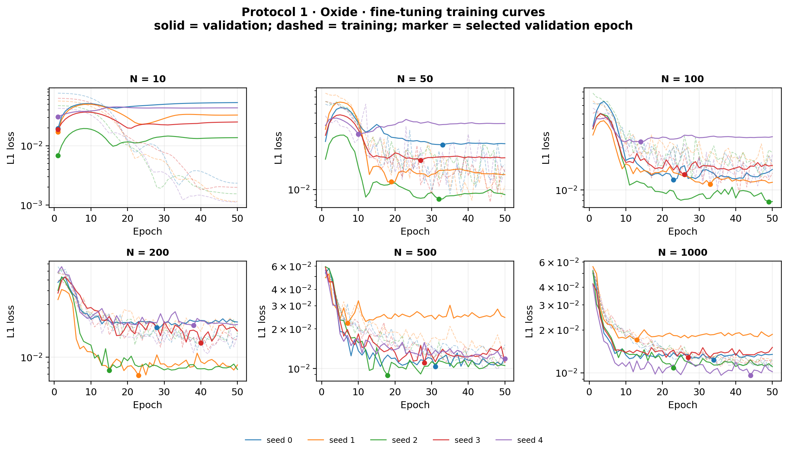

**Figure trace P5-F-S2-S1-FT-OXIDE-TRAINING.** Protocol 1 Oxide Fine-Tuning Training Grid. The grid contains all 30 canonical runs in this set/family/method slice.

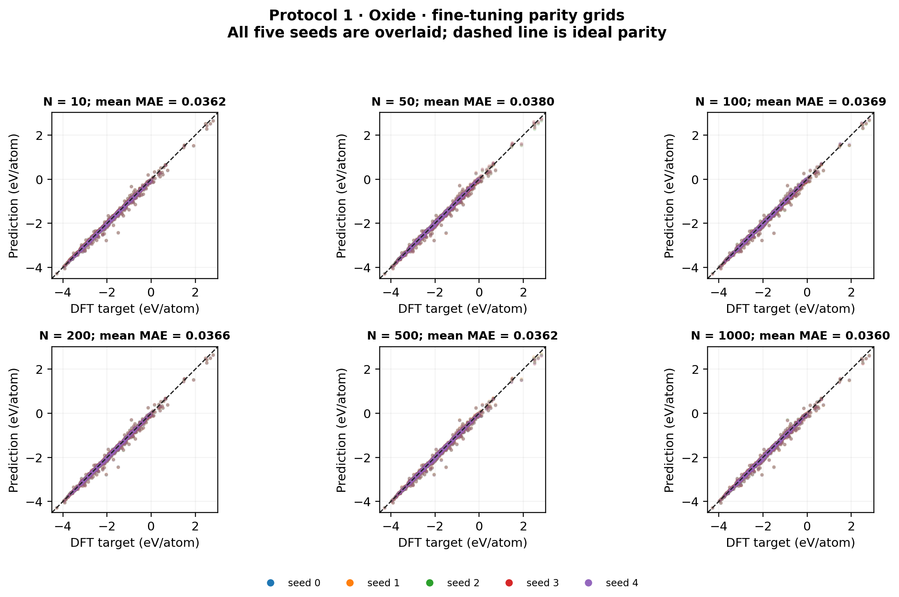

**Figure trace P5-F-S2-S1-FT-OXIDE-PARITY.** Protocol 1 Oxide Fine-Tuning Parity Grid. The grid contains all 30 canonical runs in this set/family/method slice.

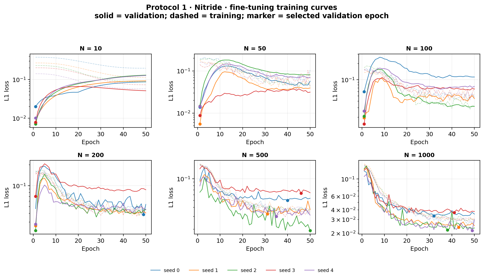

**Figure trace P5-F-S2-S1-FT-NITRIDE-TRAINING.** Protocol 1 Nitride Fine-Tuning Training Grid. The grid contains all 30 canonical runs in this set/family/method slice.

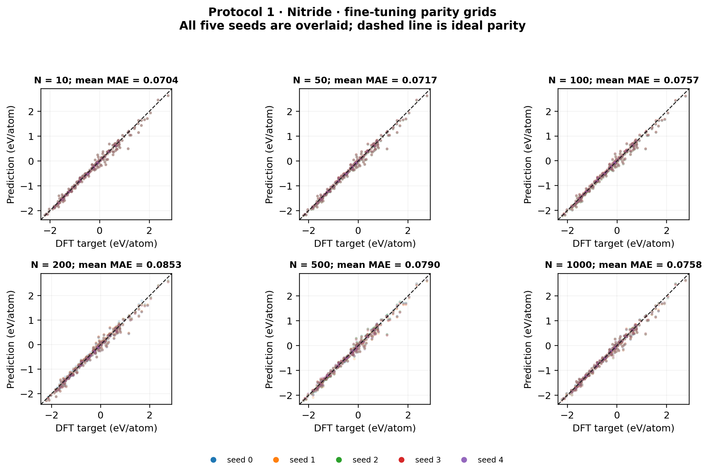

**Figure trace P5-F-S2-S1-FT-NITRIDE-PARITY.** Protocol 1 Nitride Fine-Tuning Parity Grid. The grid contains all 30 canonical runs in this set/family/method slice.

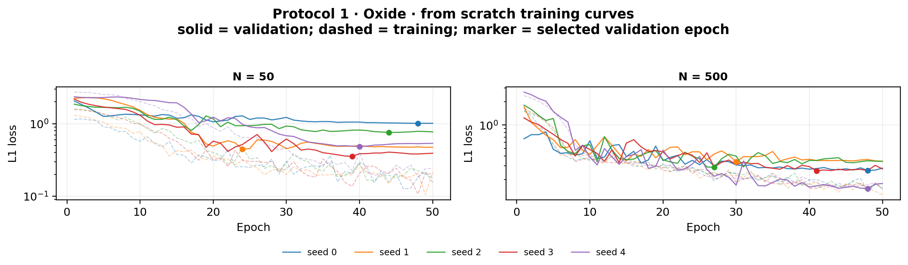

**Figure trace P5-F-S2-S1-SCR-OXIDE-TRAINING.** Protocol 1 Oxide From Scratch Training Grid. The grid contains all 10 canonical runs in this set/family/method slice.

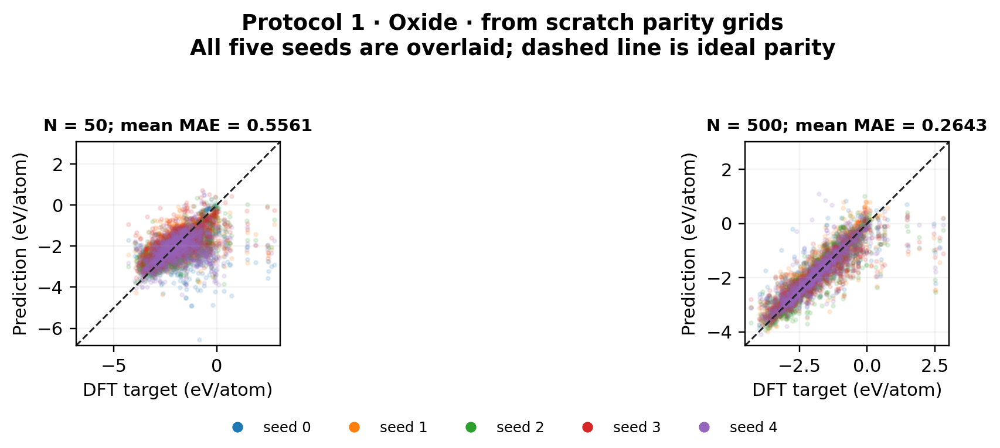

**Figure trace P5-F-S2-S1-SCR-OXIDE-PARITY.** Protocol 1 Oxide From Scratch Parity Grid. The grid contains all 10 canonical runs in this set/family/method slice.

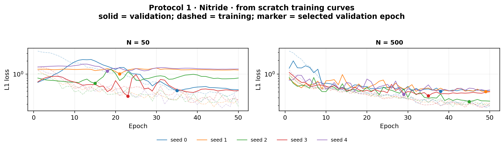

**Figure trace P5-F-S2-S1-SCR-NITRIDE-TRAINING.** Protocol 1 Nitride From Scratch Training Grid. The grid contains all 10 canonical runs in this set/family/method slice.

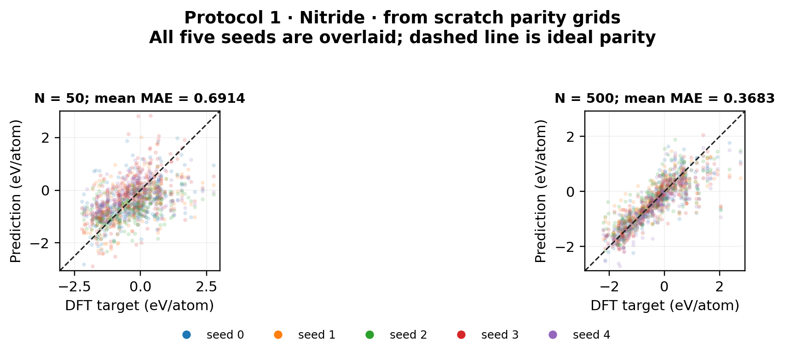

**Figure trace P5-F-S2-S1-SCR-NITRIDE-PARITY.** Protocol 1 Nitride From Scratch Parity Grid. The grid contains all 10 canonical runs in this set/family/method slice.

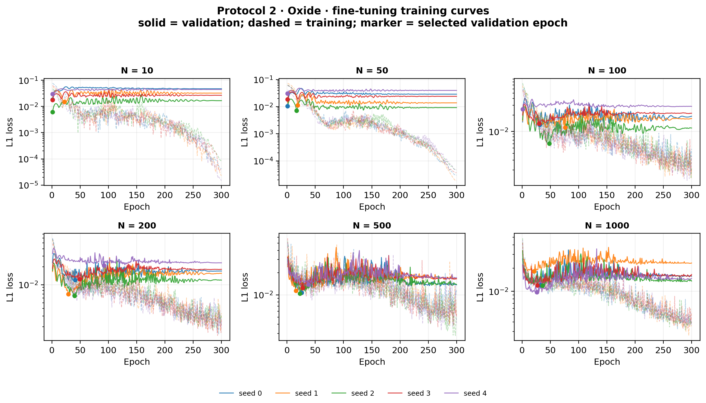

**Figure trace P5-F-S2-S2-FT-OXIDE-TRAINING.** Protocol 2 Oxide Fine-Tuning Training Grid. The grid contains all 30 canonical runs in this set/family/method slice.

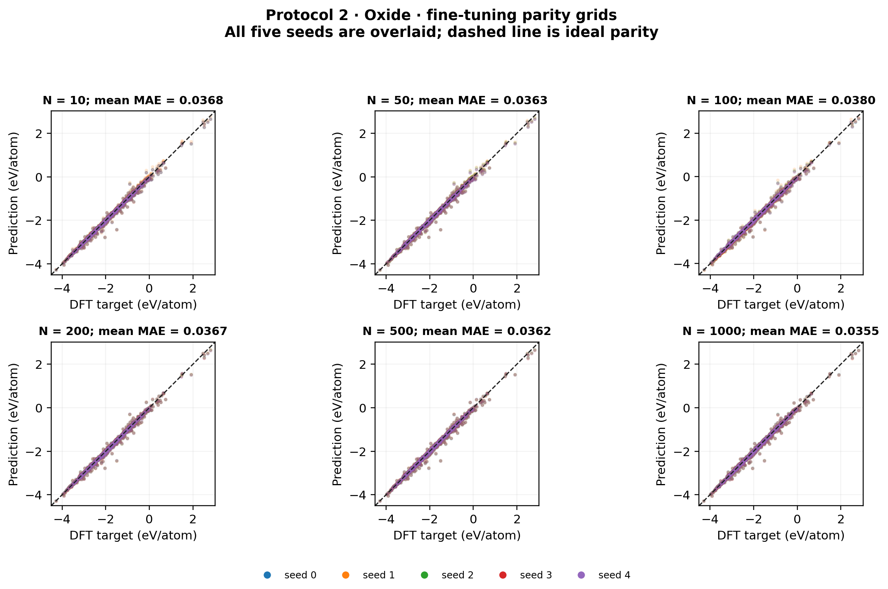

**Figure trace P5-F-S2-S2-FT-OXIDE-PARITY.** Protocol 2 Oxide Fine-Tuning Parity Grid. The grid contains all 30 canonical runs in this set/family/method slice.

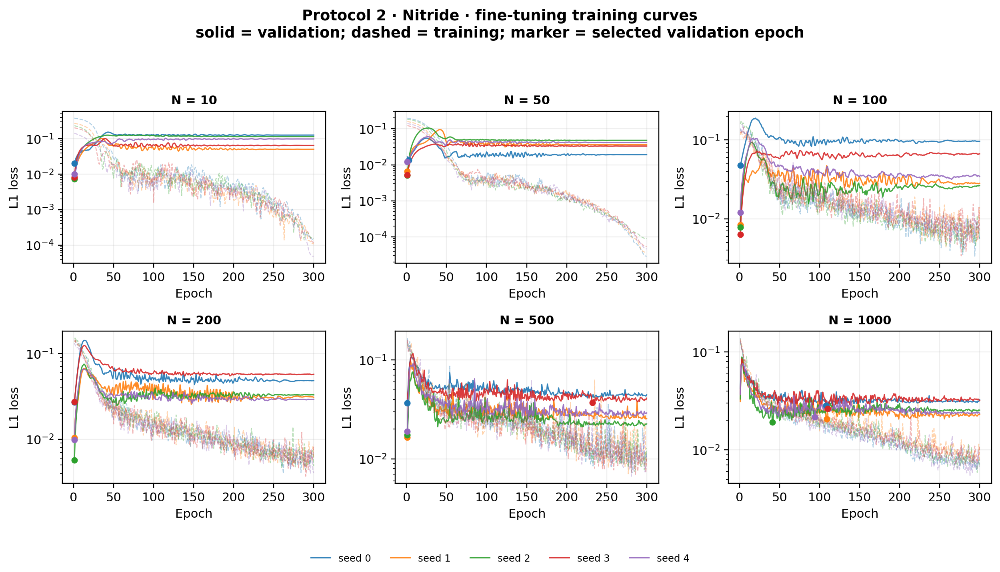

**Figure trace P5-F-S2-S2-FT-NITRIDE-TRAINING.** Protocol 2 Nitride Fine-Tuning Training Grid. The grid contains all 30 canonical runs in this set/family/method slice.

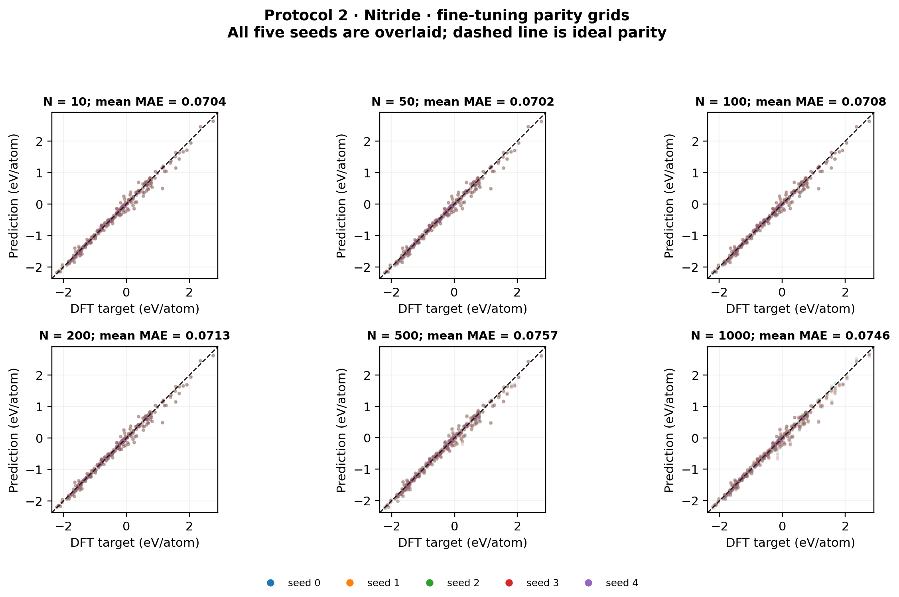

**Figure trace P5-F-S2-S2-FT-NITRIDE-PARITY.** Protocol 2 Nitride Fine-Tuning Parity Grid. The grid contains all 30 canonical runs in this set/family/method slice.

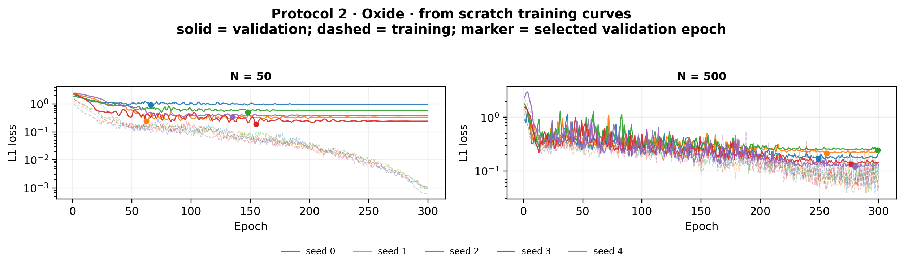

**Figure trace P5-F-S2-S2-SCR-OXIDE-TRAINING.** Protocol 2 Oxide From Scratch Training Grid. The grid contains all 10 canonical runs in this set/family/method slice.

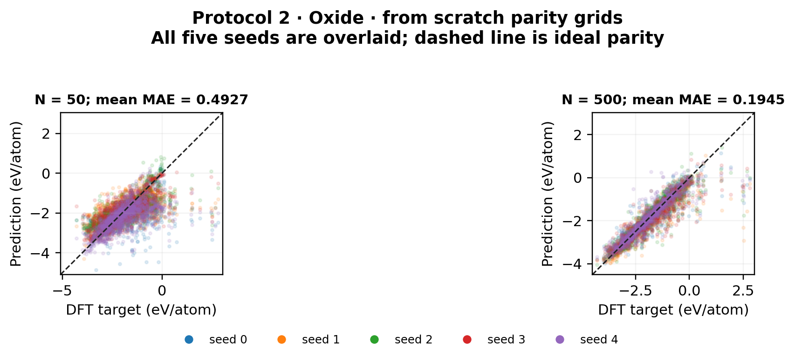

**Figure trace P5-F-S2-S2-SCR-OXIDE-PARITY.** Protocol 2 Oxide From Scratch Parity Grid. The grid contains all 10 canonical runs in this set/family/method slice.

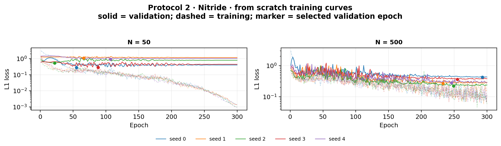

**Figure trace P5-F-S2-S2-SCR-NITRIDE-TRAINING.** Protocol 2 Nitride From Scratch Training Grid. The grid contains all 10 canonical runs in this set/family/method slice.

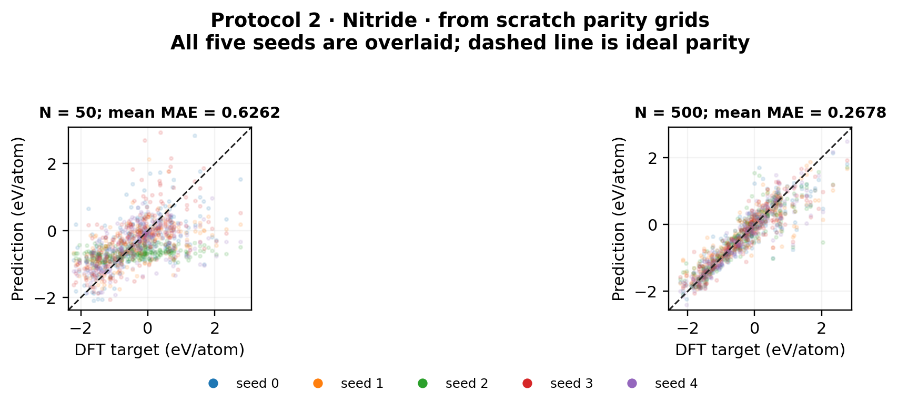

**Figure trace P5-F-S2-S2-SCR-NITRIDE-PARITY.** Protocol 2 Nitride From Scratch Parity Grid. The grid contains all 10 canonical runs in this set/family/method slice.

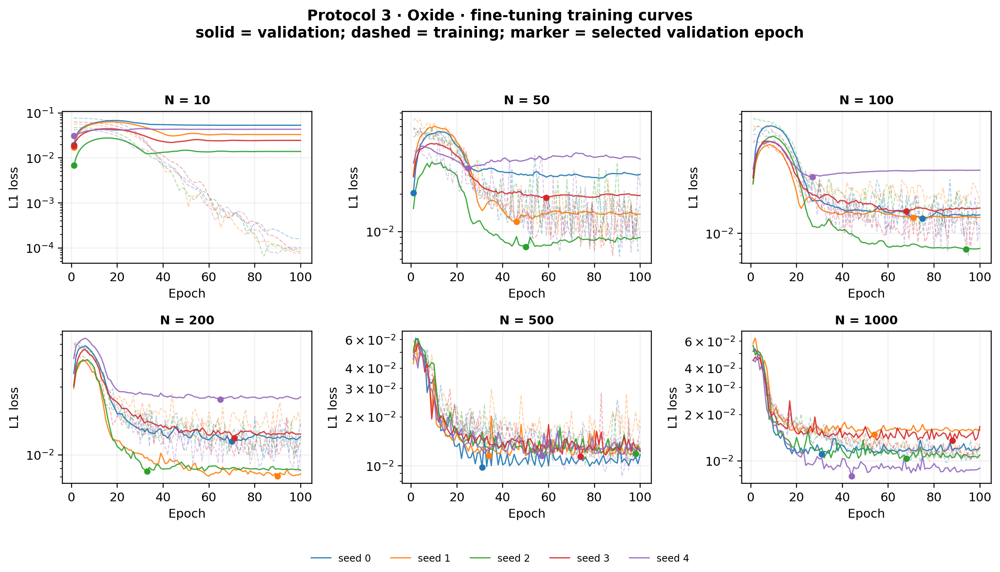

**Figure trace P5-F-S2-S3-FT-OXIDE-TRAINING.** Protocol 3 Oxide Fine-Tuning Training Grid. The grid contains all 30 canonical runs in this set/family/method slice.

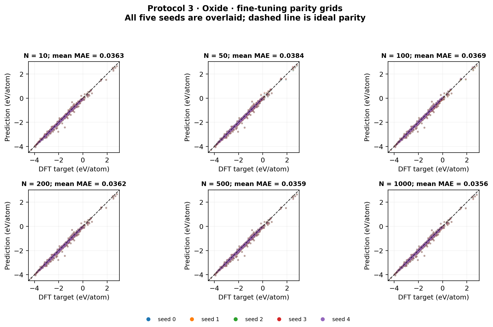

**Figure trace P5-F-S2-S3-FT-OXIDE-PARITY.** Protocol 3 Oxide Fine-Tuning Parity Grid. The grid contains all 30 canonical runs in this set/family/method slice.

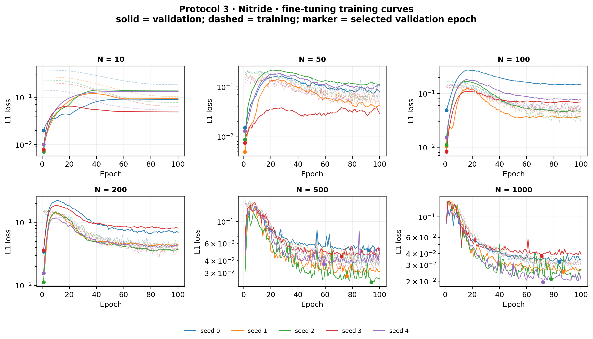

**Figure trace P5-F-S2-S3-FT-NITRIDE-TRAINING.** Protocol 3 Nitride Fine-Tuning Training Grid. The grid contains all 30 canonical runs in this set/family/method slice.

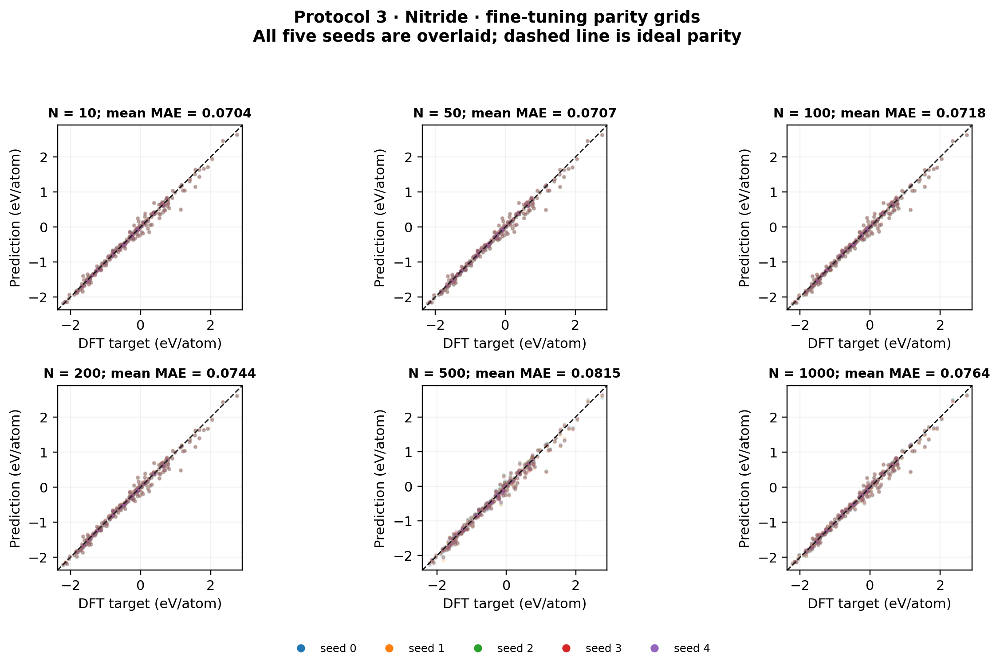

**Figure trace P5-F-S2-S3-FT-NITRIDE-PARITY.** Protocol 3 Nitride Fine-Tuning Parity Grid. The grid contains all 30 canonical runs in this set/family/method slice.

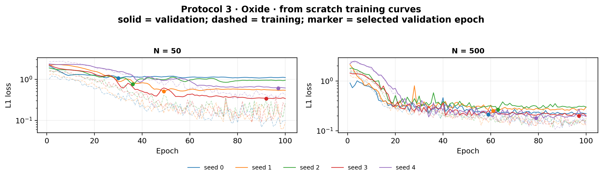

**Figure trace P5-F-S2-S3-SCR-OXIDE-TRAINING.** Protocol 3 Oxide From Scratch Training Grid. The grid contains all 10 canonical runs in this set/family/method slice.

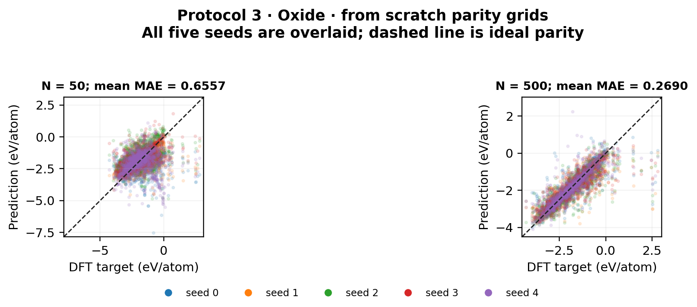

**Figure trace P5-F-S2-S3-SCR-OXIDE-PARITY.** Protocol 3 Oxide From Scratch Parity Grid. The grid contains all 10 canonical runs in this set/family/method slice.

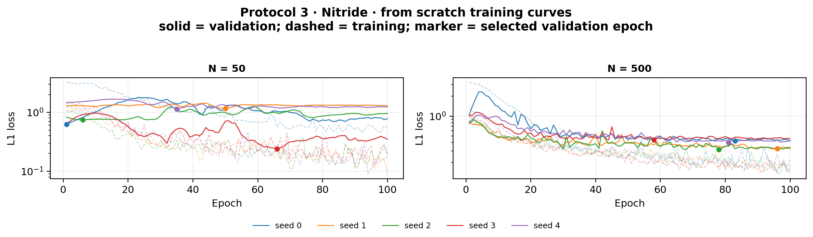

**Figure trace P5-F-S2-S3-SCR-NITRIDE-TRAINING.** Protocol 3 Nitride From Scratch Training Grid. The grid contains all 10 canonical runs in this set/family/method slice.

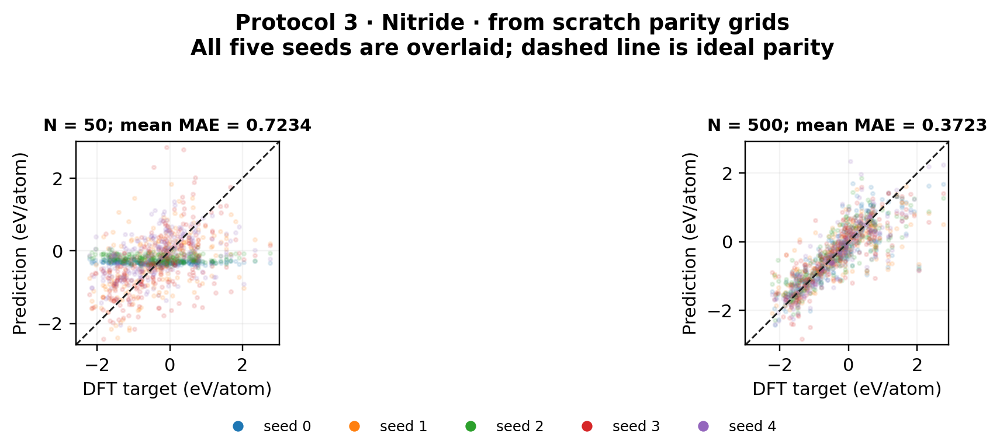

**Figure trace P5-F-S2-S3-SCR-NITRIDE-PARITY.** Protocol 3 Nitride From Scratch Parity Grid. The grid contains all 10 canonical runs in this set/family/method slice.

## S7. Structure-level heterogeneity and tertile profile

This section backs the manuscript's Section 4.2 statement that aggregate degradation conceals substantial structure-level heterogeneity. The first table reports, at the engaged budgets (N = 500 and N = 1,000), the fraction of fixed-test structures whose absolute error improved under fine-tuning, computed per seed (mean and SD across seeds) and from the seed-mean prediction. The second table profiles those improvements within tertiles of zero-shot absolute error, together with the mean signed change in absolute error (fine-tuned minus zero-shot). The tertile contrast is descriptive and partly reflects regression to the mean; it should not be read as evidence that fine-tuning targets difficult structures.

| Family | N | Per-seed frac. improved (mean) | Per-seed frac. improved (SD) | Seed-mean-AE frac. improved | Trace |
| --- | --- | --- | --- | --- | --- |
| Oxide | 500 | 0.4204 | 0.0086 | 0.3821 | A3-OX-500 |
| Oxide | 1,000 | 0.4276 | 0.0068 | 0.4057 | A3-OX-1000 |
| Nitride | 500 | 0.3736 | 0.0156 | 0.3554 | A3-NI-500 |
| Nitride | 1,000 | 0.3876 | 0.0254 | 0.3471 | A3-NI-1000 |

Improvement and mean absolute-error change within zero-shot-error tertiles (tertile 1 = easiest, tertile 3 = hardest):

| Family | N | ZS-AE tertile | n structures | Per-seed frac. improved (mean) | Mean ΔAE (FT − ZS, eV/atom) | Trace |
| --- | --- | --- | --- | --- | --- | --- |
| Oxide | 500 | 1 | 495 | 0.2598 | 0.00503 | A3-OX-500-T1 |
| Oxide | 500 | 2 | 494 | 0.4968 | 0.00066 | A3-OX-500-T2 |
| Oxide | 500 | 3 | 495 | 0.5046 | 0.00032 | A3-OX-500-T3 |
| Oxide | 1,000 | 1 | 495 | 0.2921 | 0.00433 | A3-OX-1000-T1 |
| Oxide | 1,000 | 2 | 494 | 0.5036 | 0.00031 | A3-OX-1000-T2 |
| Oxide | 1,000 | 3 | 495 | 0.4873 | 0.00072 | A3-OX-1000-T3 |
| Nitride | 500 | 1 | 81 | 0.1753 | 0.02166 | A3-NI-500-T1 |
| Nitride | 500 | 2 | 80 | 0.4500 | 0.00633 | A3-NI-500-T2 |
| Nitride | 500 | 3 | 81 | 0.4963 | 0.00049 | A3-NI-500-T3 |
| Nitride | 1,000 | 1 | 81 | 0.2049 | 0.01439 | A3-NI-1000-T1 |
| Nitride | 1,000 | 2 | 80 | 0.4500 | 0.00414 | A3-NI-1000-T2 |
| Nitride | 1,000 | 3 | 81 | 0.5086 | 0.00014 | A3-NI-1000-T3 |

## S8. Learning-dynamics summary

This section backs the manuscript's Section 4.2 learning-dynamics statements. For each condition it reports the median relative validation improvement from the end of epoch 1 to the validation-selected epoch, the median gap between the final-epoch and best validation L1 (a check that training did not simply overfit the tiny validation set), the number of seeds (of five) that selected the last available epoch (the schedule boundary), and the across-seed standard deviation of the selected epoch. Non-zero relative improvement and wide selected-epoch dispersion indicate genuine optimizer engagement even where the fixed-test error did not improve.

| Family | N | Median rel. epoch-1→best val improvement | Median (final − best) val L1 | Boundary(50) selections (of 5) | Best-epoch SD | Trace |
| --- | --- | --- | --- | --- | --- | --- |
| Oxide | 10 | 0.0000 | 0.01260 | 0 | 0.0 | A4-OX-10 |
| Oxide | 50 | 0.4092 | 0.00103 | 0 | 9.7 | A4-OX-50 |
| Oxide | 100 | 0.6482 | 0.00294 | 0 | 13.1 | A4-OX-100 |
| Oxide | 200 | 0.6695 | 0.00168 | 0 | 10.4 | A4-OX-200 |
| Oxide | 500 | 0.8056 | 0.00167 | 1 | 16.0 | A4-OX-500 |
| Oxide | 1,000 | 0.7553 | 0.00119 | 0 | 11.6 | A4-OX-1000 |
| Nitride | 10 | 0.0000 | 0.08506 | 0 | 0.0 | A4-NI-10 |
| Nitride | 50 | 0.0000 | 0.04328 | 0 | 0.0 | A4-NI-50 |
| Nitride | 100 | 0.0000 | 0.04910 | 0 | 0.0 | A4-NI-100 |
| Nitride | 200 | 0.0000 | 0.01706 | 0 | 21.5 | A4-NI-200 |
| Nitride | 500 | 0.6225 | 0.00132 | 1 | 7.8 | A4-NI-500 |
| Nitride | 1,000 | 0.7995 | 0.00140 | 0 | 6.3 | A4-NI-1000 |

## S9. Complete Protocol 2 and Protocol 3 robustness tables and curves

This section reports the complete Protocol 2 and Protocol 3 robustness surfaces behind the manuscript's Section 4.4 cross-protocol result. Protocol 2 and 3 vary only the optimization schedule; they are protocol-sensitivity evidence and are never pooled with Protocol 1.

Protocol 2 and 3 test alternative optimization schedules only. Their 120 fine-tuning runs and 40 scratch runs are reported as protocol-sensitivity evidence, not pooled with Protocol 1. Means and sample standard deviations use five seeds (`ddof=1`).

### S9.1 Protocol 2 complete robustness surface

| Method | Family | N | MAE mean | Sample SD | Best epoch mean | Range | Trace |
| --- | --- | --- | --- | --- | --- | --- | --- |
| fine-tune | oxide | 10 | 0.036765 | 0.003182 | 5.2 | 1–22 | P5-A017 |
| fine-tune | oxide | 50 | 0.036334 | 0.001421 | 7.8 | 1–19 | P5-A018 |
| fine-tune | oxide | 100 | 0.038016 | 0.001999 | 37.2 | 1–76 | P5-A019 |
| fine-tune | oxide | 200 | 0.036672 | 0.000946 | 50.2 | 29–92 | P5-A020 |
| fine-tune | oxide | 500 | 0.036181 | 0.000368 | 26.2 | 16–38 | P5-A021 |
| fine-tune | oxide | 1000 | 0.035487 | 0.000139 | 28.4 | 21–36 | P5-A022 |
| fine-tune | nitride | 10 | 0.070360 | 0.000193 | 1.0 | 1–1 | P5-A023 |
| fine-tune | nitride | 50 | 0.070223 | 0.000582 | 1.4 | 1–3 | P5-A024 |
| fine-tune | nitride | 100 | 0.070761 | 0.000298 | 1.0 | 1–1 | P5-A025 |
| fine-tune | nitride | 200 | 0.071269 | 0.000403 | 1.0 | 1–1 | P5-A026 |
| fine-tune | nitride | 500 | 0.075743 | 0.001070 | 47.2 | 1–232 | P5-A027 |
| fine-tune | nitride | 1000 | 0.074611 | 0.000846 | 92.4 | 41–110 | P5-A028 |
| scratch | oxide | 50 | 0.492697 | 0.038609 | 113.2 | 62–155 | P5-A029 |
| scratch | oxide | 500 | 0.194452 | 0.004850 | 272.2 | 249–299 | P5-A030 |
| scratch | nitride | 50 | 0.626238 | 0.079031 | 67.6 | 22–107 | P5-A031 |
| scratch | nitride | 500 | 0.267789 | 0.016398 | 255.2 | 233–293 | P5-A032 |

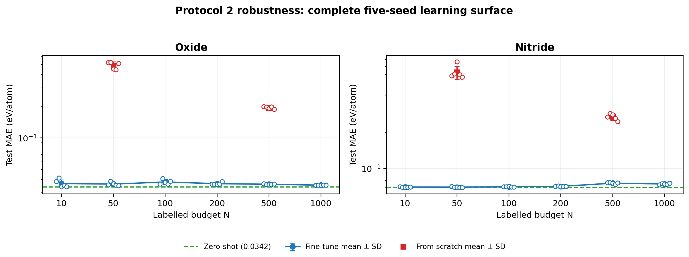

**Figure trace P5-F-S3-Protocol 2-LEARNING.** Five-seed Protocol 2 learning surface. Seed points remain visible; scratch is shown only at N = 50 and 500.

### S9.2 Protocol 3 complete robustness surface

| Method | Family | N | MAE mean | Sample SD | Best epoch mean | Range | Trace |
| --- | --- | --- | --- | --- | --- | --- | --- |
| fine-tune | oxide | 10 | 0.036266 | 0.002001 | 1.0 | 1–1 | P5-A033 |
| fine-tune | oxide | 50 | 0.038438 | 0.001956 | 36.2 | 1–59 | P5-A034 |
| fine-tune | oxide | 100 | 0.036852 | 0.001296 | 67.0 | 27–94 | P5-A035 |
| fine-tune | oxide | 200 | 0.036169 | 0.000198 | 65.8 | 33–90 | P5-A036 |
| fine-tune | oxide | 500 | 0.035865 | 0.000308 | 58.8 | 31–98 | P5-A037 |
| fine-tune | oxide | 1000 | 0.035571 | 0.000189 | 57.0 | 31–88 | P5-A038 |
| fine-tune | nitride | 10 | 0.070407 | 0.000202 | 1.0 | 1–1 | P5-A039 |
| fine-tune | nitride | 50 | 0.070709 | 0.000603 | 1.0 | 1–1 | P5-A040 |
| fine-tune | nitride | 100 | 0.071761 | 0.000760 | 1.0 | 1–1 | P5-A041 |
| fine-tune | nitride | 200 | 0.074404 | 0.000640 | 1.0 | 1–1 | P5-A042 |
| fine-tune | nitride | 500 | 0.081523 | 0.001514 | 78.6 | 59–94 | P5-A043 |
| fine-tune | nitride | 1000 | 0.076357 | 0.000199 | 78.4 | 71–87 | P5-A044 |
| scratch | oxide | 50 | 0.655693 | 0.103290 | 60.8 | 30–97 | P5-A045 |
| scratch | oxide | 500 | 0.269012 | 0.008699 | 71.8 | 59–97 | P5-A046 |
| scratch | nitride | 50 | 0.723362 | 0.063144 | 31.6 | 1–66 | P5-A047 |
| scratch | nitride | 500 | 0.372287 | 0.024852 | 79.2 | 58–96 | P5-A048 |

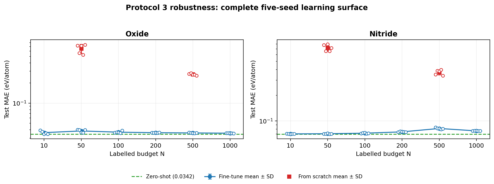

**Figure trace P5-F-S3-Protocol 3-LEARNING.** Five-seed Protocol 3 learning surface. Seed points remain visible; scratch is shown only at N = 50 and 500.

## S10. Cross-protocol effect magnitudes

This section quantifies the manuscript's Section 4.4 "36 of 36" result with effect sizes rather than bare means. For every condition across all three protocols it reports Δadapt = MAE_FT − MAE_ZS (positive = worse) and Radapt = 100 · Δadapt / MAE_ZS, using the same definitions as S3. All 36 condition means lie above their family zero-shot baseline; the per-family Δadapt and Radapt ranges quoted in the manuscript are read directly from this table (the Protocol 1 rows coincide with S3).

| Set | Family | N | Fine-tuned MAE (mean) | Zero-shot MAE | Δadapt (eV/atom) | Radapt (%) | Trace |
| --- | --- | --- | --- | --- | --- | --- | --- |
| Protocol 1 | Oxide | 10 | 0.03624 | 0.03418 | +0.00206 | 6.0 | A5-1-OX-10 |
| Protocol 1 | Oxide | 50 | 0.03800 | 0.03418 | +0.00381 | 11.2 | A5-1-OX-50 |
| Protocol 1 | Oxide | 100 | 0.03687 | 0.03418 | +0.00269 | 7.9 | A5-1-OX-100 |
| Protocol 1 | Oxide | 200 | 0.03658 | 0.03418 | +0.00240 | 7.0 | A5-1-OX-200 |
| Protocol 1 | Oxide | 500 | 0.03619 | 0.03418 | +0.00200 | 5.9 | A5-1-OX-500 |
| Protocol 1 | Oxide | 1,000 | 0.03597 | 0.03418 | +0.00179 | 5.2 | A5-1-OX-1000 |
| Protocol 1 | Nitride | 10 | 0.07040 | 0.06954 | +0.00086 | 1.2 | A5-1-NI-10 |
| Protocol 1 | Nitride | 50 | 0.07167 | 0.06954 | +0.00213 | 3.1 | A5-1-NI-50 |
| Protocol 1 | Nitride | 100 | 0.07567 | 0.06954 | +0.00613 | 8.8 | A5-1-NI-100 |
| Protocol 1 | Nitride | 200 | 0.08528 | 0.06954 | +0.01574 | 22.6 | A5-1-NI-200 |
| Protocol 1 | Nitride | 500 | 0.07905 | 0.06954 | +0.00951 | 13.7 | A5-1-NI-500 |
| Protocol 1 | Nitride | 1,000 | 0.07577 | 0.06954 | +0.00623 | 9.0 | A5-1-NI-1000 |
| Protocol 2 | Oxide | 10 | 0.03677 | 0.03418 | +0.00258 | 7.6 | A5-2-OX-10 |
| Protocol 2 | Oxide | 50 | 0.03633 | 0.03418 | +0.00215 | 6.3 | A5-2-OX-50 |
| Protocol 2 | Oxide | 100 | 0.03802 | 0.03418 | +0.00383 | 11.2 | A5-2-OX-100 |
| Protocol 2 | Oxide | 200 | 0.03667 | 0.03418 | +0.00249 | 7.3 | A5-2-OX-200 |
| Protocol 2 | Oxide | 500 | 0.03618 | 0.03418 | +0.00200 | 5.8 | A5-2-OX-500 |
| Protocol 2 | Oxide | 1,000 | 0.03549 | 0.03418 | +0.00130 | 3.8 | A5-2-OX-1000 |
| Protocol 2 | Nitride | 10 | 0.07036 | 0.06954 | +0.00082 | 1.2 | A5-2-NI-10 |
| Protocol 2 | Nitride | 50 | 0.07022 | 0.06954 | +0.00068 | 1.0 | A5-2-NI-50 |
| Protocol 2 | Nitride | 100 | 0.07076 | 0.06954 | +0.00122 | 1.8 | A5-2-NI-100 |
| Protocol 2 | Nitride | 200 | 0.07127 | 0.06954 | +0.00173 | 2.5 | A5-2-NI-200 |
| Protocol 2 | Nitride | 500 | 0.07574 | 0.06954 | +0.00620 | 8.9 | A5-2-NI-500 |
| Protocol 2 | Nitride | 1,000 | 0.07461 | 0.06954 | +0.00507 | 7.3 | A5-2-NI-1000 |
| Protocol 3 | Oxide | 10 | 0.03627 | 0.03418 | +0.00208 | 6.1 | A5-3-OX-10 |
| Protocol 3 | Oxide | 50 | 0.03844 | 0.03418 | +0.00425 | 12.4 | A5-3-OX-50 |
| Protocol 3 | Oxide | 100 | 0.03685 | 0.03418 | +0.00267 | 7.8 | A5-3-OX-100 |
| Protocol 3 | Oxide | 200 | 0.03617 | 0.03418 | +0.00199 | 5.8 | A5-3-OX-200 |
| Protocol 3 | Oxide | 500 | 0.03586 | 0.03418 | +0.00168 | 4.9 | A5-3-OX-500 |
| Protocol 3 | Oxide | 1,000 | 0.03557 | 0.03418 | +0.00139 | 4.1 | A5-3-OX-1000 |
| Protocol 3 | Nitride | 10 | 0.07041 | 0.06954 | +0.00087 | 1.2 | A5-3-NI-10 |
| Protocol 3 | Nitride | 50 | 0.07071 | 0.06954 | +0.00117 | 1.7 | A5-3-NI-50 |
| Protocol 3 | Nitride | 100 | 0.07176 | 0.06954 | +0.00222 | 3.2 | A5-3-NI-100 |
| Protocol 3 | Nitride | 200 | 0.07440 | 0.06954 | +0.00486 | 7.0 | A5-3-NI-200 |
| Protocol 3 | Nitride | 500 | 0.08152 | 0.06954 | +0.01198 | 17.2 | A5-3-NI-500 |
| Protocol 3 | Nitride | 1,000 | 0.07636 | 0.06954 | +0.00682 | 9.8 | A5-3-NI-1000 |

## S11. Alternative embedding layers, projection sensitivity, and distance metrics

This section provides the frozen-representation family-separation metrics, the projection-parameter sensitivity, and the full multi-layer, multi-distance grids underlying the manuscript's Section 4.5 representation discussion. All inferential metrics are computed in the raw 256-dimensional space; projection panels are descriptive.

All inferential family-separation metrics below are computed in raw, unprojected 256-dimensional space. `pre_head` and `last_gcn_pool` are byte-identical arrays and are not independent confirmations. Metric ordering differs across criteria, so no layer is called uniformly strongest. Projection panels are descriptive only.

### S11.1 Raw-space overall family metrics

| Dataset | Layer | Metric | Value | 95% CI | n | Trace |
| --- | --- | --- | --- | --- | --- | --- |
| balanced_pool_set | last_alignn_pool | davies_bouldin_index | 1.785601 | [1.743173, 1.828551] | 4092 | P5-E018 |
| balanced_pool_set | last_alignn_pool | knn_family_purity | 0.976703 | [0.973720, 0.979538] | 4092 | P5-E019 |
| balanced_pool_set | last_alignn_pool | logistic_regression_family_auc | 0.999302 | [0.998492, 0.999874] | 4092 | P5-E020 |
| balanced_pool_set | last_alignn_pool | silhouette_score | 0.207680 | [0.204030, 0.211407] | 4092 | P5-E017 |
| balanced_pool_set | last_gcn_pool | davies_bouldin_index | 1.644543 | [1.600164, 1.688761] | 4092 | P5-E022 |
| balanced_pool_set | last_gcn_pool | knn_family_purity | 0.970055 | [0.966356, 0.973689] | 4092 | P5-E023 |
| balanced_pool_set | last_gcn_pool | logistic_regression_family_auc | 0.998933 | [0.998358, 0.999392] | 4092 | P5-E024 |
| balanced_pool_set | last_gcn_pool | silhouette_score | 0.214800 | [0.210172, 0.219712] | 4092 | P5-E021 |
| balanced_pool_set | pre_head | davies_bouldin_index | 1.644543 | [1.597605, 1.688486] | 4092 | P5-E014 |
| balanced_pool_set | pre_head | knn_family_purity | 0.970055 | [0.966340, 0.973169] | 4092 | P5-E015 |
| balanced_pool_set | pre_head | logistic_regression_family_auc | 0.998914 | [0.998213, 0.999438] | 4092 | P5-E016 |
| balanced_pool_set | pre_head | silhouette_score | 0.214800 | [0.210176, 0.219497] | 4092 | P5-E013 |
| fixed_test_set | last_alignn_pool | davies_bouldin_index | 1.828988 | [1.733954, 1.907125] | 1726 | P5-E006 |
| fixed_test_set | last_alignn_pool | knn_family_purity | 0.965547 | [0.960293, 0.970761] | 1726 | P5-E007 |
| fixed_test_set | last_alignn_pool | logistic_regression_family_auc | 0.999362 | [0.998365, 0.999944] | 1726 | P5-E008 |
| fixed_test_set | last_alignn_pool | silhouette_score | 0.239249 | [0.233165, 0.245635] | 1726 | P5-E005 |
| fixed_test_set | last_gcn_pool | davies_bouldin_index | 1.693650 | [1.608125, 1.779855] | 1726 | P5-E010 |
| fixed_test_set | last_gcn_pool | knn_family_purity | 0.957706 | [0.951563, 0.963192] | 1726 | P5-E011 |
| fixed_test_set | last_gcn_pool | logistic_regression_family_auc | 0.997332 | [0.995589, 0.998755] | 1726 | P5-E012 |
| fixed_test_set | last_gcn_pool | silhouette_score | 0.190499 | [0.182074, 0.199343] | 1726 | P5-E009 |
| fixed_test_set | pre_head | davies_bouldin_index | 1.693650 | [1.609462, 1.781087] | 1726 | P5-E002 |
| fixed_test_set | pre_head | knn_family_purity | 0.957706 | [0.951868, 0.963578] | 1726 | P5-E003 |
| fixed_test_set | pre_head | logistic_regression_family_auc | 0.997611 | [0.995616, 0.998970] | 1726 | P5-E004 |
| fixed_test_set | pre_head | silhouette_score | 0.190499 | [0.181795, 0.199231] | 1726 | P5-E001 |

### S11.2 Projection-parameter sensitivity

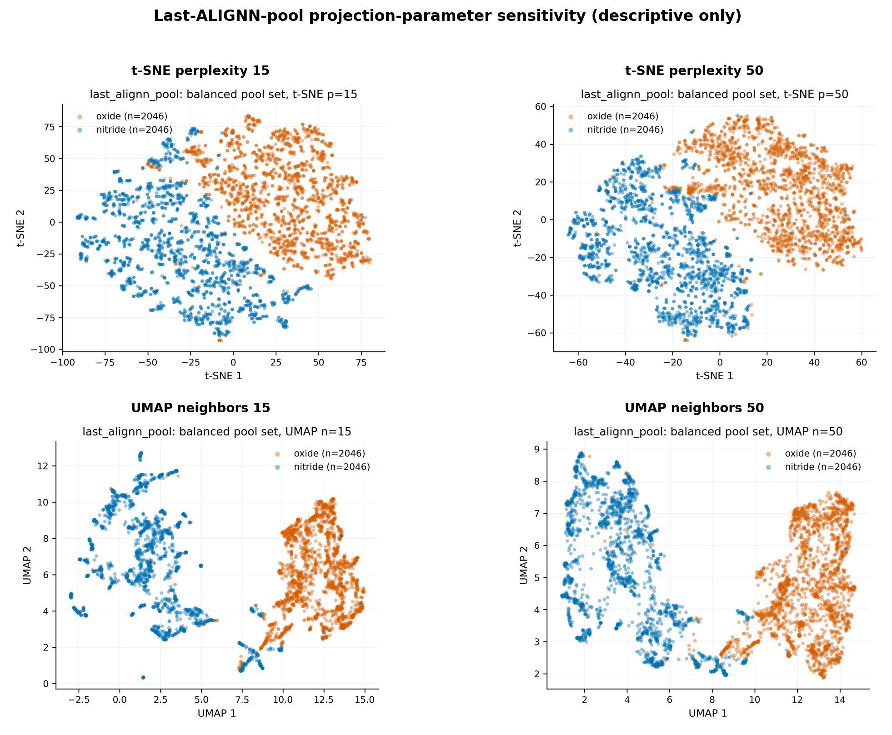

**Figure trace P5-F-S4-PROJECTION.** Last-ALIGNN-pool family-label projections at t-SNE perplexities 15 and 50 and UMAP neighbor counts 15 and 50. The main settings are 30 for each method; all use standardized direct 256D inputs, no pre-reduction, UMAP `min_dist=0.1`, and random state 42. Projection geometry is descriptive rather than inferential.

### S11.3 Canonical last-ALIGNN-pool centroid, 5-NN, and Mahalanobis results

| Distance | Statistic | Value | 95% CI | BH-FDR q | Trace |
| --- | --- | --- | --- | --- | --- |
| oxide_centroid_distance | spearman_correlation | 0.172316 | [0.042036, 0.294759] | 0.003900 | P5-DP-001 |
| oxide_centroid_distance | pearson_correlation | 0.233051 | [0.117639, 0.352912] | 0.000450 | P5-DP-002 |
| oxide_centroid_distance | hard_minus_easy_mean_distance | 0.613052 | [0.090368, 1.098600] | 0.010499 | P5-DP-003 |
| oxide_centroid_distance | hard_minus_easy_median_distance | 0.557581 | [-0.256314, 1.381272] | 0.049995 | P5-DP-004 |
| oxide_knn5_mean_distance | spearman_correlation | 0.345956 | [0.225382, 0.463050] | 0.000150 | P5-DP-005 |
| oxide_knn5_mean_distance | pearson_correlation | 0.277906 | [0.174792, 0.390841] | 0.000300 | P5-DP-006 |
| oxide_knn5_mean_distance | hard_minus_easy_mean_distance | 0.816762 | [0.474592, 1.159698] | 0.000300 | P5-DP-007 |
| oxide_knn5_mean_distance | hard_minus_easy_median_distance | 0.872928 | [0.416100, 1.286405] | 0.000300 | P5-DP-008 |
| oxide_mahalanobis_lw_distance | spearman_correlation | 0.244681 | [0.109478, 0.366259] | 0.000150 | P5-DP-009 |
| oxide_mahalanobis_lw_distance | pearson_correlation | 0.207937 | [0.082352, 0.343904] | 0.001000 | P5-DP-010 |
| oxide_mahalanobis_lw_distance | hard_minus_easy_mean_distance | 4.580063 | [1.539606, 7.525797] | 0.003750 | P5-DP-011 |
| oxide_mahalanobis_lw_distance | hard_minus_easy_median_distance | 5.451899 | [1.001832, 8.377521] | 0.001800 | P5-DP-012 |

### S11.4 Alternative-layer nine-cell distance sensitivity

This table uses canonical CSV errors across three embedding sources and three distance definitions. Its nine-cell multiplicity family is sensitivity evidence only; the prespecified three-distance last-ALIGNN-pool family controls the main claim. Identical `pre_head` and `last_gcn_pool` arrays remain non-independent.

| Layer | Distance | Statistic | Value | 95% CI | Nine-cell q | Trace |
| --- | --- | --- | --- | --- | --- | --- |
| pre_head | oxide_centroid_distance | spearman_correlation | 0.256789 | [0.134233, 0.368564] | 0.000225 | P5-DN-001 |
| pre_head | oxide_centroid_distance | pearson_correlation | 0.304476 | [0.209038, 0.402252] | 0.000129 | P5-DN-002 |
| pre_head | oxide_centroid_distance | hard_minus_easy_mean_distance | 1.221454 | [0.594467, 1.835498] | 0.000180 | P5-DN-003 |
| pre_head | oxide_centroid_distance | hard_minus_easy_median_distance | 1.106858 | [0.247430, 2.282864] | 0.002250 | P5-DN-004 |
| pre_head | oxide_knn5_mean_distance | spearman_correlation | 0.410972 | [0.298141, 0.518084] | 0.000129 | P5-DN-005 |
| pre_head | oxide_knn5_mean_distance | pearson_correlation | 0.340525 | [0.246516, 0.439827] | 0.000129 | P5-DN-006 |
| pre_head | oxide_knn5_mean_distance | hard_minus_easy_mean_distance | 0.947174 | [0.589180, 1.314001] | 0.000180 | P5-DN-007 |
| pre_head | oxide_knn5_mean_distance | hard_minus_easy_median_distance | 0.931409 | [0.417407, 1.286011] | 0.000300 | P5-DN-008 |
| pre_head | oxide_mahalanobis_lw_distance | spearman_correlation | 0.306510 | [0.181100, 0.424287] | 0.000129 | P5-DN-009 |
| pre_head | oxide_mahalanobis_lw_distance | pearson_correlation | 0.305170 | [0.202832, 0.415576] | 0.000129 | P5-DN-010 |
| pre_head | oxide_mahalanobis_lw_distance | hard_minus_easy_mean_distance | 5.680529 | [2.476110, 8.773275] | 0.000771 | P5-DN-011 |
| pre_head | oxide_mahalanobis_lw_distance | hard_minus_easy_median_distance | 6.283088 | [2.826596, 9.054770] | 0.001575 | P5-DN-012 |
| last_alignn_pool | oxide_centroid_distance | spearman_correlation | 0.172316 | [0.042036, 0.294759] | 0.003900 | P5-DN-013 |
| last_alignn_pool | oxide_centroid_distance | pearson_correlation | 0.233051 | [0.117639, 0.352912] | 0.000337 | P5-DN-014 |
| last_alignn_pool | oxide_centroid_distance | hard_minus_easy_mean_distance | 0.613052 | [0.090368, 1.098600] | 0.010499 | P5-DN-015 |
| last_alignn_pool | oxide_centroid_distance | hard_minus_easy_median_distance | 0.557581 | [-0.256314, 1.381272] | 0.049995 | P5-DN-016 |
| last_alignn_pool | oxide_knn5_mean_distance | spearman_correlation | 0.345956 | [0.225382, 0.463050] | 0.000129 | P5-DN-017 |
| last_alignn_pool | oxide_knn5_mean_distance | pearson_correlation | 0.277906 | [0.174792, 0.390841] | 0.000129 | P5-DN-018 |
| last_alignn_pool | oxide_knn5_mean_distance | hard_minus_easy_mean_distance | 0.816762 | [0.474592, 1.159698] | 0.000180 | P5-DN-019 |
| last_alignn_pool | oxide_knn5_mean_distance | hard_minus_easy_median_distance | 0.872928 | [0.416100, 1.286405] | 0.000300 | P5-DN-020 |
| last_alignn_pool | oxide_mahalanobis_lw_distance | spearman_correlation | 0.244681 | [0.109478, 0.366259] | 0.000129 | P5-DN-021 |
| last_alignn_pool | oxide_mahalanobis_lw_distance | pearson_correlation | 0.207937 | [0.082352, 0.343904] | 0.001000 | P5-DN-022 |
| last_alignn_pool | oxide_mahalanobis_lw_distance | hard_minus_easy_mean_distance | 4.580063 | [1.539606, 7.525797] | 0.002812 | P5-DN-023 |
| last_alignn_pool | oxide_mahalanobis_lw_distance | hard_minus_easy_median_distance | 5.451899 | [1.001832, 8.377521] | 0.001800 | P5-DN-024 |
| last_gcn_pool | oxide_centroid_distance | spearman_correlation | 0.256789 | [0.134789, 0.370767] | 0.000129 | P5-DN-025 |
| last_gcn_pool | oxide_centroid_distance | pearson_correlation | 0.304476 | [0.208781, 0.399143] | 0.000129 | P5-DN-026 |
| last_gcn_pool | oxide_centroid_distance | hard_minus_easy_mean_distance | 1.221454 | [0.599648, 1.827328] | 0.000180 | P5-DN-027 |
| last_gcn_pool | oxide_centroid_distance | hard_minus_easy_median_distance | 1.106858 | [0.257008, 2.254457] | 0.002250 | P5-DN-028 |
| last_gcn_pool | oxide_knn5_mean_distance | spearman_correlation | 0.410972 | [0.296473, 0.515743] | 0.000129 | P5-DN-029 |
| last_gcn_pool | oxide_knn5_mean_distance | pearson_correlation | 0.340525 | [0.252877, 0.436535] | 0.000129 | P5-DN-030 |
| last_gcn_pool | oxide_knn5_mean_distance | hard_minus_easy_mean_distance | 0.947174 | [0.592537, 1.324303] | 0.000180 | P5-DN-031 |
| last_gcn_pool | oxide_knn5_mean_distance | hard_minus_easy_median_distance | 0.931409 | [0.387475, 1.294496] | 0.000300 | P5-DN-032 |
| last_gcn_pool | oxide_mahalanobis_lw_distance | spearman_correlation | 0.306510 | [0.185973, 0.422541] | 0.000129 | P5-DN-033 |
| last_gcn_pool | oxide_mahalanobis_lw_distance | pearson_correlation | 0.305170 | [0.193919, 0.414279] | 0.000129 | P5-DN-034 |
| last_gcn_pool | oxide_mahalanobis_lw_distance | hard_minus_easy_mean_distance | 5.680529 | [2.645321, 8.623017] | 0.000300 | P5-DN-035 |
| last_gcn_pool | oxide_mahalanobis_lw_distance | hard_minus_easy_median_distance | 6.283088 | [2.870830, 9.037036] | 0.001800 | P5-DN-036 |

## S12. Canonical distance–error recomputation and three-distance robustness

This section is the canonical distance–error recomputation behind the manuscript's Section 4.5 association result. The three prespecified raw-space distances (five-nearest-oxide, regularized Mahalanobis, and oxide-centroid) substantiate the manuscript's direction-stability statement: each yields a positive Spearman correlation with a positive confidence interval and a corrected q-value, as tabulated below (the same three distances also appear across embedding layers in S11.4). All statements remain correlational and protocol-specific.

The canonical recomputation status is `INCLUDE_C6_IN_MAIN_PAPER` with `C6_MAIN=true` [P5-G-DISTANCE-DECISION]. Canonical nitride zero-shot prediction errors are joined by JID to frozen last-ALIGNN-pool embeddings; no embedding-metadata prediction or error field is used. Coverage is 242/242 nitrides, with 13,507 oxide-reference vectors and 49/49/144 hard/easy/middle structures [P5-G-DISTANCE-COUNTS].

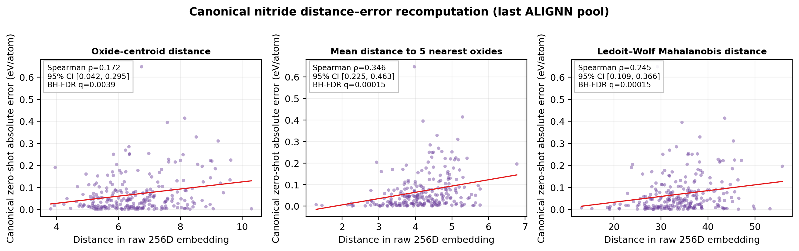

**Figure trace P5-F-S8-DISTANCE.** Canonical zero-shot absolute error versus three prespecified raw-space distances. Lines are descriptive least-squares guides; inference uses the registered bootstrap/permutation results in the table below.

| Distance | Statistic | Value | 95% CI | p | BH-FDR q | Trace |
| --- | --- | --- | --- | --- | --- | --- |
| oxide_centroid_distance | spearman_correlation | 0.172316 | [0.042036, 0.294759] | 0.003900 | 0.003900 | P5-DP-001 |
| oxide_centroid_distance | pearson_correlation | 0.233051 | [0.117639, 0.352912] | 0.000300 | 0.000450 | P5-DP-002 |
| oxide_centroid_distance | hard_minus_easy_mean_distance | 0.613052 | [0.090368, 1.098600] | 0.010499 | 0.010499 | P5-DP-003 |
| oxide_centroid_distance | hard_minus_easy_median_distance | 0.557581 | [-0.256314, 1.381272] | 0.049995 | 0.049995 | P5-DP-004 |
| oxide_knn5_mean_distance | spearman_correlation | 0.345956 | [0.225382, 0.463050] | 0.000100 | 0.000150 | P5-DP-005 |
| oxide_knn5_mean_distance | pearson_correlation | 0.277906 | [0.174792, 0.390841] | 0.000100 | 0.000300 | P5-DP-006 |
| oxide_knn5_mean_distance | hard_minus_easy_mean_distance | 0.816762 | [0.474592, 1.159698] | 0.000100 | 0.000300 | P5-DP-007 |
| oxide_knn5_mean_distance | hard_minus_easy_median_distance | 0.872928 | [0.416100, 1.286405] | 0.000100 | 0.000300 | P5-DP-008 |
| oxide_mahalanobis_lw_distance | spearman_correlation | 0.244681 | [0.109478, 0.366259] | 0.000100 | 0.000150 | P5-DP-009 |
| oxide_mahalanobis_lw_distance | pearson_correlation | 0.207937 | [0.082352, 0.343904] | 0.001000 | 0.001000 | P5-DP-010 |
| oxide_mahalanobis_lw_distance | hard_minus_easy_mean_distance | 4.580063 | [1.539606, 7.525797] | 0.002500 | 0.003750 | P5-DP-011 |
| oxide_mahalanobis_lw_distance | hard_minus_easy_median_distance | 5.451899 | [1.001832, 8.377521] | 0.001200 | 0.001800 | P5-DP-012 |

The primary 5-NN Spearman association is positive under the prespecified three-distance multiplicity family. All distance–error statements remain correlational and protocol-specific; they do not establish a causal mechanism or independently prove domain shift. Historical embedding_analysis error-colored and hard/easy figures are not reused because their embedding metadata predictions drift from the canonical CSV errors.

## S13. Pure-oxide (oxynitride-excluded) sensitivity

This section backs the manuscript's Section 4.5 pure-oxide robustness note and the Section 5 family-definition discussion. Removing oxynitrides from the oxide reference side leaves the zero-shot ratio and the frozen-embedding support flags qualitatively unchanged; the inclusive analysis remains primary.

The primary oxide comparator contains O and therefore retains O+N structures. This sensitivity removes 57 oxynitrides from the fixed oxide test set (1,484 to 1,427) while leaving 242 nitrides unchanged [P5-G-OXYN-57; P5-G-OXTEST-1484; P5-G-PURETEST-1427; P5-G-NTEST-242]. It covers zero-shot and frozen-representation analyses only; no pure-oxide fine-tuning or retraining was performed.

### S13.1 Point estimates

| Scenario | Oxide n | Nitride n | Oxide MAE | Nitride MAE | Difference | Ratio | Trace |
| --- | --- | --- | --- | --- | --- | --- | --- |
| inclusive_oxide_vs_nitride | 1484 | 242 | 0.034184 | 0.069542 | 0.035358 | 2.034367 | P5-OP-001 |
| pure_oxide_filtered_vs_nitride | 1427 | 242 | 0.033900 | 0.069542 | 0.035642 | 2.051394 | P5-OP-002 |
| oxynitride_only_descriptive | 57 | 0 | 0.041287 | — | — | — | P5-OP-003 |
| sensitivity_filtered_minus_inclusive | 1427 | 242 | — | — | — | — | P5-OP-004 |

### S13.2 Structure-bootstrap uncertainty

Each scenario uses 50,000 independent within-family nonparametric structure-bootstrap replicates and percentile intervals. Difference is nitride minus oxide; ratio is nitride over oxide. No sensitivity interval is manufactured by subtracting endpoints from separate intervals.

| Scenario | Estimand | Estimate | SE | 95% CI | n oxide/nitride | Trace |
| --- | --- | --- | --- | --- | --- | --- |
| inclusive_oxide_vs_nitride | oxide_mae | 0.034184 | 0.001583 | [0.031216, 0.037397] | 1484/242 | P5-OB-001 |
| inclusive_oxide_vs_nitride | nitride_mae | 0.069542 | 0.005424 | [0.059277, 0.080615] | 1484/242 | P5-OB-002 |
| inclusive_oxide_vs_nitride | mae_difference_nitride_minus_oxide | 0.035358 | 0.005644 | [0.024581, 0.046764] | 1484/242 | P5-OB-003 |
| inclusive_oxide_vs_nitride | mae_ratio_nitride_over_oxide | 2.034367 | 0.184726 | [1.695158, 2.421179] | 1484/242 | P5-OB-004 |
| pure_oxide_filtered_vs_nitride | oxide_mae | 0.033900 | 0.001621 | [0.030849, 0.037182] | 1427/242 | P5-OB-005 |
| pure_oxide_filtered_vs_nitride | nitride_mae | 0.069542 | 0.005434 | [0.059255, 0.080563] | 1427/242 | P5-OB-006 |
| pure_oxide_filtered_vs_nitride | mae_difference_nitride_minus_oxide | 0.035642 | 0.005665 | [0.024958, 0.047047] | 1427/242 | P5-OB-007 |
| pure_oxide_filtered_vs_nitride | mae_ratio_nitride_over_oxide | 2.051394 | 0.188308 | [1.709941, 2.443590] | 1427/242 | P5-OB-008 |

### S13.3 Full frozen-embedding sensitivity deltas

| Dataset | Layer | Metric | Scope | Inclusive | Pure oxide | Delta | Trace |
| --- | --- | --- | --- | --- | --- | --- | --- |
| fixed_test_set | pre_head | silhouette_score | overall_family_labels | 0.190499 | 0.204535 | 0.014036 | P5-OE-001 |
| fixed_test_set | pre_head | silhouette_score | oxide | 0.185195 | 0.200371 | 0.015175 | P5-OE-002 |
| fixed_test_set | pre_head | silhouette_score | nitride | 0.223024 | 0.229091 | 0.006067 | P5-OE-003 |
| fixed_test_set | pre_head | davies_bouldin_index | overall_family_labels | 1.693650 | 1.638481 | -0.055169 | P5-OE-004 |
| fixed_test_set | pre_head | knn_family_purity | overall_family_labels | 0.957706 | 0.965528 | 0.007823 | P5-OE-005 |
| fixed_test_set | pre_head | knn_family_purity | oxide | 0.983738 | 0.986358 | 0.002621 | P5-OE-006 |
| fixed_test_set | pre_head | knn_family_purity | nitride | 0.798072 | 0.842700 | 0.044628 | P5-OE-007 |
| fixed_test_set | pre_head | logistic_regression_family_auc | overall_family_labels | 0.997611 | 0.999490 | 0.001879 | P5-OE-008 |
| fixed_test_set | last_alignn_pool | silhouette_score | overall_family_labels | 0.239249 | 0.253141 | 0.013892 | P5-OE-009 |
| fixed_test_set | last_alignn_pool | silhouette_score | oxide | 0.254564 | 0.270676 | 0.016112 | P5-OE-010 |
| fixed_test_set | last_alignn_pool | silhouette_score | nitride | 0.145336 | 0.149741 | 0.004405 | P5-OE-011 |
| fixed_test_set | last_alignn_pool | davies_bouldin_index | overall_family_labels | 1.828988 | 1.767794 | -0.061194 | P5-OE-012 |
| fixed_test_set | last_alignn_pool | knn_family_purity | overall_family_labels | 0.965547 | 0.974236 | 0.008690 | P5-OE-013 |
| fixed_test_set | last_alignn_pool | knn_family_purity | oxide | 0.987152 | 0.991170 | 0.004018 | P5-OE-014 |
| fixed_test_set | last_alignn_pool | knn_family_purity | nitride | 0.833058 | 0.874380 | 0.041322 | P5-OE-015 |
| fixed_test_set | last_alignn_pool | logistic_regression_family_auc | overall_family_labels | 0.999362 | 0.999968 | 0.000606 | P5-OE-016 |
| fixed_test_set | last_gcn_pool | silhouette_score | overall_family_labels | 0.190499 | 0.204535 | 0.014036 | P5-OE-017 |
| fixed_test_set | last_gcn_pool | silhouette_score | oxide | 0.185195 | 0.200371 | 0.015175 | P5-OE-018 |
| fixed_test_set | last_gcn_pool | silhouette_score | nitride | 0.223024 | 0.229091 | 0.006067 | P5-OE-019 |
| fixed_test_set | last_gcn_pool | davies_bouldin_index | overall_family_labels | 1.693650 | 1.638481 | -0.055169 | P5-OE-020 |
| fixed_test_set | last_gcn_pool | knn_family_purity | overall_family_labels | 0.957706 | 0.965528 | 0.007823 | P5-OE-021 |
| fixed_test_set | last_gcn_pool | knn_family_purity | oxide | 0.983738 | 0.986358 | 0.002621 | P5-OE-022 |
| fixed_test_set | last_gcn_pool | knn_family_purity | nitride | 0.798072 | 0.842700 | 0.044628 | P5-OE-023 |
| fixed_test_set | last_gcn_pool | logistic_regression_family_auc | overall_family_labels | 0.997332 | 0.999667 | 0.002335 | P5-OE-024 |
| balanced_pool_set | pre_head | silhouette_score | overall_family_labels | 0.214800 | 0.222283 | 0.007484 | P5-OE-025 |
| balanced_pool_set | pre_head | silhouette_score | oxide | 0.194106 | 0.204228 | 0.010122 | P5-OE-026 |
| balanced_pool_set | pre_head | silhouette_score | nitride | 0.235493 | 0.239844 | 0.004351 | P5-OE-027 |
| balanced_pool_set | pre_head | davies_bouldin_index | overall_family_labels | 1.644543 | 1.610128 | -0.034415 | P5-OE-028 |
| balanced_pool_set | pre_head | knn_family_purity | overall_family_labels | 0.970055 | 0.976264 | 0.006208 | P5-OE-029 |
| balanced_pool_set | pre_head | knn_family_purity | oxide | 0.968361 | 0.974506 | 0.006145 | P5-OE-030 |
| balanced_pool_set | pre_head | knn_family_purity | nitride | 0.971750 | 0.977973 | 0.006224 | P5-OE-031 |
| balanced_pool_set | pre_head | logistic_regression_family_auc | overall_family_labels | 0.998914 | 0.999903 | 0.000989 | P5-OE-032 |
| balanced_pool_set | last_alignn_pool | silhouette_score | overall_family_labels | 0.207680 | 0.214046 | 0.006366 | P5-OE-033 |
| balanced_pool_set | last_alignn_pool | silhouette_score | oxide | 0.259994 | 0.270883 | 0.010889 | P5-OE-034 |
| balanced_pool_set | last_alignn_pool | silhouette_score | nitride | 0.155366 | 0.158764 | 0.003398 | P5-OE-035 |
| balanced_pool_set | last_alignn_pool | davies_bouldin_index | overall_family_labels | 1.785601 | 1.746050 | -0.039551 | P5-OE-036 |
| balanced_pool_set | last_alignn_pool | knn_family_purity | overall_family_labels | 0.976703 | 0.983168 | 0.006466 | P5-OE-037 |
| balanced_pool_set | last_alignn_pool | knn_family_purity | oxide | 0.975204 | 0.981139 | 0.005935 | P5-OE-038 |
| balanced_pool_set | last_alignn_pool | knn_family_purity | nitride | 0.978201 | 0.985142 | 0.006940 | P5-OE-039 |
| balanced_pool_set | last_alignn_pool | logistic_regression_family_auc | overall_family_labels | 0.999302 | 0.999999 | 0.000698 | P5-OE-040 |
| balanced_pool_set | last_gcn_pool | silhouette_score | overall_family_labels | 0.214800 | 0.222283 | 0.007484 | P5-OE-041 |
| balanced_pool_set | last_gcn_pool | silhouette_score | oxide | 0.194106 | 0.204228 | 0.010122 | P5-OE-042 |
| balanced_pool_set | last_gcn_pool | silhouette_score | nitride | 0.235493 | 0.239844 | 0.004351 | P5-OE-043 |
| balanced_pool_set | last_gcn_pool | davies_bouldin_index | overall_family_labels | 1.644543 | 1.610128 | -0.034415 | P5-OE-044 |
| balanced_pool_set | last_gcn_pool | knn_family_purity | overall_family_labels | 0.970055 | 0.976264 | 0.006208 | P5-OE-045 |
| balanced_pool_set | last_gcn_pool | knn_family_purity | oxide | 0.968361 | 0.974506 | 0.006145 | P5-OE-046 |
| balanced_pool_set | last_gcn_pool | knn_family_purity | nitride | 0.971750 | 0.977973 | 0.006224 | P5-OE-047 |
| balanced_pool_set | last_gcn_pool | logistic_regression_family_auc | overall_family_labels | 0.998933 | 0.999916 | 0.000984 | P5-OE-048 |

The validated disposition is `INTERPRETATION_STABLE`: filtering changes numerical values but not the qualitative interpretation; the inclusive analysis remains primary.

## Supplementary data and reproducibility files

The public research artifact is available at https://github.com/TheArchitect999/ALIGNN-domain-shift. This document, its machine-readable tables, and all supplementary figures are stored under `paper/supplementary/`; manuscript-number traceability is provided by `paper/evidence_manifest.csv`. Dataset reconstruction and analysis entry points are documented in `docs/REPRODUCING.md`.
